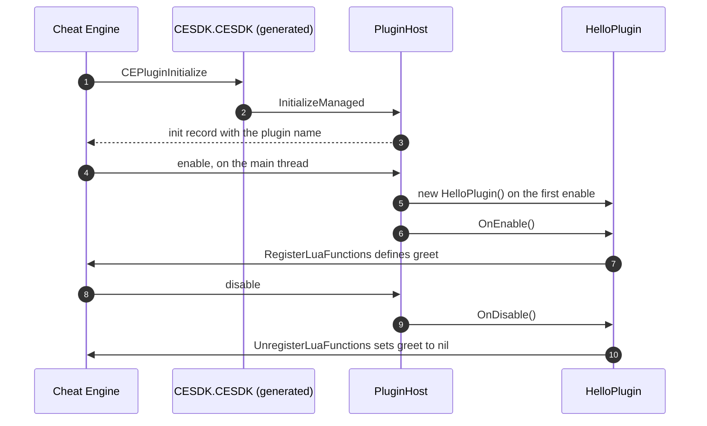

<div align="center">

# 01 · Your first plugin

**From an empty folder to a C# function that Cheat Engine's Lua engine can call.**

**Level** `Beginner` · **Time** `10 min` · **Needs** `Cheat Engine 7.7`

[Examples index](../README.md) · [Next: Lua functions](../02-lua-functions/README.md)

</div>

---

|               |                                                                                    |
|---------------|------------------------------------------------------------------------------------|
| **You build** | A plugin that exports one Lua function, `greet`                                    |
| **You learn** | The project file, the plugin class, the build output and how Cheat Engine loads it |
| **You need**  | .NET SDK 10.0.401 or later, Cheat Engine 7.7, Windows x64                          |

## Objective

Load a plugin into Cheat Engine, enable it, and call your own C# code from the Lua Engine window. You use one NuGet
package and one class.

## Why it matters

Cheat Engine finds a managed plugin by a hard-coded name, and it refuses a plugin whose entry point has the wrong shape
without saying why. CheatEngine.SDK generates that entry point for you. Your project holds only your code, and a mistake shows up
as a compiler message before Cheat Engine ever starts.

## How it works

### 1. Create the project

```powershell
dotnet new classlib -n MyPlugin
cd MyPlugin
dotnet add package CheatEngine.SDK --prerelease
Remove-Item Class1.cs
```

Then open `MyPlugin.csproj` and add the `PlatformTarget` line. The finished file looks like this:

```xml
<Project Sdk="Microsoft.NET.Sdk">
  <PropertyGroup>
    <TargetFramework>net10.0</TargetFramework>
    <ImplicitUsings>enable</ImplicitUsings>
    <Nullable>enable</Nullable>
    <PlatformTarget>x64</PlatformTarget>
  </PropertyGroup>
  <ItemGroup>
    <PackageReference Include="CheatEngine.SDK" Version="0.3.0" />
  </ItemGroup>
</Project>
```

The package also sets `AllowUnsafeBlocks` and `EnableDynamicLoading` for you, each one only while your project leaves it
empty. Cheat Engine hosts plugins in an x64 process, so an `x86` target stops the build with `CESDK9101`.

### 2. Write the plugin

```csharp
using CheatEngine.SDK.Annotations.Lua;
using CheatEngine.SDK.Annotations.Plugin;
using CheatEngine.SDK.Hosting.Plugin;
using CheatEngine.SDK.Lua.Runtime;

namespace MyPlugin;

[CheatEnginePlugin("My Plugin")]
public sealed class HelloPlugin : CheatEnginePlugin
{
    protected override void OnEnable() => Commands.RegisterLuaFunctions(LuaRuntime.AcquireState());

    protected override void OnDisable() => Commands.UnregisterLuaFunctions(LuaRuntime.AcquireState());
}

internal static partial class Commands
{
    [LuaFunction("greet")]
    public static string Greet(string name) => $"Hello, {name}!";
}
```

| Piece                              | What it does                                                                                  |
|------------------------------------|-----------------------------------------------------------------------------------------------|
| `[CheatEnginePlugin("My Plugin")]` | Marks the one plugin class and sets the name Cheat Engine lists in its plugin settings        |
| `CheatEnginePlugin`                | The base class. `OnEnable` and `OnDisable` are abstract and run on Cheat Engine's main thread |
| `LuaRuntime.AcquireState()`        | Hands you the Lua state of the calling thread. Call it once per operation and never store it  |
| `[LuaFunction("greet")]`           | Exports a static method as the Lua global `greet`                                             |
| `partial` on `Commands`            | Lets the generator add `RegisterLuaFunctions` and `UnregisterLuaFunctions` to your type       |

> [!IMPORTANT]
> Do not touch CheatEngine.SDK from a constructor, a field initializer or a static constructor. The Lua runtime attaches after
> the plugin is constructed, so anything you call there throws. Do your setup in `OnEnable`.

> [!WARNING]
> Keep your code out of the `CESDK` namespace. Cheat Engine requires the plugin assembly to contain the type
> `CESDK.CESDK`, which the SDK generates. Inside the namespace `CESDK`, or any namespace under it, the simple name
> `CESDK` binds to that generated class, so a qualified name that starts with `CESDK.` no longer resolves to a namespace
> you declared under `CESDK` (`CS0426`, and analyzer `CESDK0004` warns about the namespace). Keep plugin code in a
> namespace such as `MyPlugin`. The SDK itself lives under `CheatEngine.SDK` and is not affected. A plugin assembly also
> holds exactly one `[CheatEnginePlugin]` class (`CESDK0002`).

### 3. Build

```powershell
dotnet build -c Release
```

Keep the whole output folder together. Cheat Engine loads `MyPlugin.dll`, and the CheatEngine.SDK assemblies plus the native Lua
protection bridge must sit next to it. The package supplies the bridge; no C compiler or xmake is required.

```text
bin/Release/net10.0/
    MyPlugin.dll            add this one to Cheat Engine
    MyPlugin.pdb
    MyPlugin.deps.json
    MyPlugin.runtimeconfig.json
    CheatEngine.SDK.Abi.dll
    CheatEngine.SDK.Annotations.dll
    CheatEngine.SDK.Engine.dll
    CheatEngine.SDK.Hosting.dll
    CheatEngine.SDK.Lua.dll
    CheatEngine.SDK.Lua.Interop.dll
    CheatEngine.SDK.dll
    cheatengine-sdk-lua-bridge.dll
```

### 4. Let Cheat Engine run a .NET 10 plugin

> [!IMPORTANT]
> Cheat Engine 7.7 asks for .NET 9. Before starting it, edit the Cheat Engine folder's `ce.runtimeconfig.json` in an
> elevated editor to request .NET 10 explicitly:
>
> - Set `runtimeOptions.tfm` to `net10.0`.
> - Set the `version` of every framework request to `10.0.0`: `Microsoft.NETCore.App`,
>   `Microsoft.WindowsDesktop.App`, and `Microsoft.AspNetCore.App` (whether the file uses `framework` or `frameworks`).
> - Set `runtimeOptions.rollForward` to `LatestMinor`. If a framework entry has its own `rollForward`, set it to
>   `LatestMinor` too.
>
> With that configuration, Cheat Engine stays on .NET 10 even when .NET 9 or 11 is installed. A shell launch can repeat
> the same policy, but does not select .NET 10 by itself:
>
> ```powershell
> $env:DOTNET_ROLL_FORWARD = "LatestMinor"
> .\cheatengine-x86_64.exe
> ```
>
> Keep the existing framework names. This changes only Cheat Engine's runtime request; the x64
> .NET 10 runtimes `Microsoft.NETCore.App`, `Microsoft.WindowsDesktop.App` and `Microsoft.AspNetCore.App` must already
> be installed (`dotnet --list-runtimes` lists them).

### 5. Load it and call it

1. In Cheat Engine, open **Edit > Settings > Plugins**, choose **Add new**, select `MyPlugin.dll` and tick it.
2. Open the Lua Engine window and run:

   ```lua
   print(greet("world"))
   ```

3. The output pane shows:

   ```text
   Hello, world!
   ```

Untick the plugin and `greet` becomes `nil` again, because `OnDisable` unregistered it.

## What happens when you tick the box



The plugin object is created once. Every later enable calls `OnDisable` and `OnEnable` on the same instance, and each
enable gets a fresh Lua runtime epoch, so never keep a Lua reference or a `PluginContext` across a disable.

<details>
<summary><strong>If nothing happens</strong></summary>

| Symptom                                    | Likely cause                                                                            | Fix                                                                                                                  |
|--------------------------------------------|-----------------------------------------------------------------------------------------|----------------------------------------------------------------------------------------------------------------------|
| The plugin is not listed after **Add new** | The plugin DLL is separated from CheatEngine.SDK dependencies                           | Keep the whole `bin/Release/net10.0` folder together                                                                 |
| Cheat Engine refuses the DLL               | No generated entry point                                                                | Check for `CESDK0001` or `CESDK0002` in the build output, and that `CheatEngineSdkGenerateEntryPoint` is not `false` |
| The plugin ticks and `greet` is `nil`      | `OnEnable` threw, so Cheat Engine was told the enable failed                            | Read the log below: the host logs every failed enable                                                                |
| Cheat Engine cannot start the runtime      | The x64 .NET 10 runtimes are missing or its runtime configuration still requests .NET 9 | Run `dotnet --list-runtimes` and apply step 4                                                                        |
| `CS9057` in the build                      | The .NET SDK is older than 10.0.401                                                     | Update the SDK. The generators are built against Roslyn 5.9                                                          |

To see the host's log, start Sysinternals DebugView, turn on **Capture > Capture Global Win32** and filter for
`CheatEngine.SDK`. Entries start with `[CheatEngine.SDK.Hosting] Information:` or `[CheatEngine.SDK.Hosting] Error:`.

</details>

## Promise

- One `PackageReference` is enough: the package has no NuGet dependencies and brings the analyzers and generators.
- Building generates `CESDK.CESDK.CEPluginInitialize`, the exact entry point Cheat Engine looks up.
- An `OnEnable` exception is logged and reported to Cheat Engine as a failed call. An `OnDisable` exception is logged,
  cleanup still completes, and Cheat Engine receives success to record the disabled state. Neither reaches Cheat
  Engine itself.
- A disable and a new enable reuse the same plugin instance.

## Before you move on

- [ ] `dotnet build -c Release` finishes with no warning.
- [ ] `greet("world")` prints `Hello, world!` in the Lua Engine window.
- [ ] Unticking the plugin turns `greet` back into `nil`.

---

<div align="center">

[Examples index](../README.md) · **Next:** [02 · Lua functions](../02-lua-functions/README.md)

</div>
