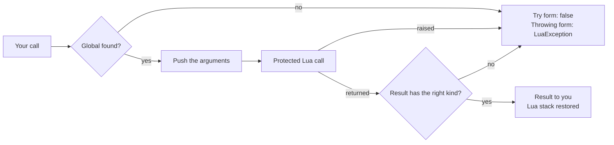

<div align="center">

# 03 · Calling Cheat Engine

**Declare a Cheat Engine Lua function as a typed C# method and let the generator write the call.**

**Level** `Beginner` · **Time** `20 min` · **Needs** `Guide 02`

[Examples index](../README.md) · [Previous: Lua functions](../02-lua-functions/README.md) · [Next: Memory](../04-memory/README.md)

</div>

---

|                            |                                                                                                                                                         |
|----------------------------|---------------------------------------------------------------------------------------------------------------------------------------------------------|
| **You build**              | A small `Ce` class that binds the Cheat Engine functions a trainer needs                                                                                |
| **You learn**              | `[LuaGlobal]`, the Try and throwing forms, overloads, copy out strings and the three ways a call fails                                                  |
| **You need**               | The plugin from [02 · Lua functions](../02-lua-functions/README.md)                                                                                     |
| **Cheat Engine functions** | `getOpenedProcessID`, `getCEVersion`, `showMessage`, `getAddress`, `getAddressSafe`, `readInteger`, `writeInteger`, `getNameFromAddress`, `openProcess` |

## Objective

Call any Cheat Engine Lua function from C# with a real signature. Arguments and results are typed, failures are
predictable, and the Lua stack stays balanced.

## Why it matters

Cheat Engine exposes its features as Lua globals. Calling one from managed code means looking the global up, pushing the
arguments, running a protected call, reading the result and restoring the stack, and every exit path has to get that
right. A `[LuaGlobal]` method states the signature once. The generator writes the body, caches the lookup and gives
every binding the same failure rules.

> [!TIP]
> Cheat Engine documents its Lua API in `celua.txt`, in the Cheat Engine folder. That file is the authority for names,
> arguments and results in your exact Cheat Engine build, so read the signature there before you declare a binding.

## How it works

### 1. Declare the bindings

```csharp
using System.Diagnostics.CodeAnalysis;
using CESDK.Annotations.Lua;

namespace GameBindings;

internal static partial class Ce
{
    [LuaGlobal("getOpenedProcessID")]
    public static partial int GetOpenedProcessId();

    [LuaGlobal("getCEVersion")]
    public static partial double GetVersion();

    [LuaGlobal("showMessage")]
    public static partial void ShowMessage(string text);

    [LuaGlobal("getAddress")]
    public static partial nuint GetAddress(string name);

    [LuaGlobal("writeInteger")]
    public static partial bool WriteInt32(nuint address, int value);

    [LuaGlobal("readInteger")]
    private static partial bool TryReadInt32Raw(nuint address, bool signed, out int value);

    public static bool TryReadInt32(nuint address, out int value) => TryReadInt32Raw(address, true, out value);

    [LuaGlobal("getAddressSafe")]
    public static partial bool TryGetAddress(string name, out nuint address);

    [LuaGlobal("getAddressSafe")]
    public static partial bool TryGetAddress(string name, bool local, out nuint address);

    [LuaGlobal("getNameFromAddress")]
    public static partial bool TryGetName(nuint address, [MaybeNullWhen(false)] out string name);

    [LuaGlobal("getNameFromAddress")]
    public static partial bool TryGetName(nuint address, Span<byte> destination, out int written);

    [LuaGlobal("openProcess")]
    public static partial void OpenProcess(string processName);

    [LuaGlobal("openProcess")]
    public static partial void OpenProcess(int processId);
}
```

A `[LuaGlobal]` method is the declaration of a `static partial` method with no body. The generator supplies the body in
a second file, so the `Ce` type and every type around it must be `partial`. Arguments come first and `out` results last.
`readInteger` defaults to an unsigned result, so the generated raw binding exposes its `signed` argument and the public
`int` helper always passes `true`.

### 2. Pick the form that matches the failure

A call can fail in three ways: the global does not exist, the Lua call raises an error, or the result is `nil` or has
the wrong kind. The form of your method decides what you see.

| Form             | Shape                                                   | On failure                                                        |
|------------------|---------------------------------------------------------|-------------------------------------------------------------------|
| Try              | Returns `bool` and ends with `out` results              | Returns `false` and leaves the results at their defaults          |
| Throwing         | Returns `void` or one value                             | Throws `LuaException`                                             |
| Boolean throwing | Returns `bool` with no `out` results, like `WriteInt32` | Reads the Lua boolean, and throws `LuaException` on failure       |
| Copy out         | Ends with `Span<byte> destination, out int written`     | Returns `false` on failure, and also when the buffer is too small |



Choose by asking whether the failure is normal. An unreadable address is normal, so `readInteger` is a Try form. A
missing `getOpenedProcessID` is a bug, so it is a throwing form.

### 3. Use the bindings

```csharp
using CESDK.Annotations.Lua;
using CESDK.Hosting.Diagnostics;
using CESDK.Lua.Calls;

namespace GameBindings;

internal static partial class Trainer
{
    [LuaFunction("my_plugin_describe")]
    public static string Describe(string symbol)
    {
        if (!Ce.TryGetAddress(symbol, out var address)) return $"{symbol} is not a known symbol";
        if (!Ce.TryReadInt32(address, out var value)) return $"{symbol} at 0x{address:X} is not readable";
        return $"{symbol} at 0x{address:X} holds {value}";
    }

    public static void ReportProcess()
    {
        try
        {
            var processId = Ce.GetOpenedProcessId();
            HostLog.Write(HostLogLevel.Information, processId == 0 ? "No process is open." : $"Process {processId} is open.");
        }
        catch (LuaException exception)
        {
            HostLog.Write(HostLogLevel.Error, "getOpenedProcessID failed.", exception);
        }
    }
}
```

`Describe` chains Try forms, so each step stops on the first normal failure and no exception is involved.
`ReportProcess` uses a throwing form and catches `LuaException` once. Register `Trainer` from `OnEnable` exactly as in
[guide 02](../02-lua-functions/README.md#2-register-on-enable-unregister-on-disable).

## What the failures look like

| Failure                       | Try form | Throwing form, `LuaException.Message`                                   |
|-------------------------------|----------|-------------------------------------------------------------------------|
| The global is not defined     | `false`  | `The Lua global 'getCEVersion' is undefined or is not a function.`      |
| The Lua call raises           | `false`  | The message Lua raised, such as `symbol not found: nope`                |
| The result is `nil`           | `false`  | `The Lua global 'probe_nil' returned a nil value, not an integer.`      |
| The result has the wrong kind | `false`  | `The Lua global 'probe_wrong' returned a string value, not an integer.` |

In every case the Lua stack returns to the height it had before the call.

## Good to know

- **Overloads share one binding.** The two `openProcess` methods, and the two `getAddressSafe` methods, each resolve
  their global once. An optional Lua parameter becomes an overload with more arguments, as in
  `TryGetAddress(name, local, out address)`.
- **The first call resolves the global.** The binding keeps the function it found in the Lua registry. A script that
  replaces the Cheat Engine function afterwards is not seen until the plugin is enabled again.
- **Addresses are `nuint` in bindings.** Convert with `Address.FromUInt64(address)` and back with
  `unchecked((nuint)value.ToUInt64())` when you use the `CESDK.Engine` value type (see
  [04 · Memory](../04-memory/README.md)).
- **Copy out text to avoid allocations.** `TryGetName(address, buffer, out written)` writes UTF-8 into a buffer you own,
  for example `stackalloc byte[64]`. A `string` result allocates one string per call.
- **Tables and objects need the toolkit.** A generated binding covers integers, numbers, booleans and text. A function
  that returns a table or an object is called through `LuaState` (see
  [06 · Value scans](../06-value-scans/README.md) and [08 · Running Lua](../08-running-lua/README.md)).
- **`out string` needs a nullable annotation.** Write `[MaybeNullWhen(false)] out string name`, or the compiler reports
  `CS8601` in the generated file.

## Promise

- The Lua stack returns to its previous height after every call, on success and on every failure.
- A Try form never throws for a missing global, a raised error or a wrong result kind.
- A throwing form reports the cause in a `LuaException` and never leaves an error value on the stack.
- A warm Try form call and a warm copy out call allocate nothing.

## Before you move on

- [ ] Every binding you wrote matches its signature in `celua.txt`.
- [ ] Each failure that is normal for your plugin is a Try form, and each failure that is a bug is a throwing form.
- [ ] The types that hold bindings are `partial`, and so are the types around them.

---

<div align="center">

[Examples index](../README.md) · **Next:** [04 · Memory](../04-memory/README.md)

</div>
