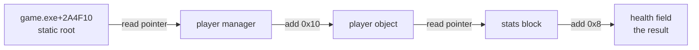

<div align="center">

# 04 · Memory

**Open a process, resolve an address, read and write typed values, and walk a pointer chain.**

**Level** `Beginner` · **Time** `25 min` · **Needs** `Guide 03`

[Examples index](../README.md) · [Previous: Calling Cheat Engine](../03-calling-cheat-engine/README.md) · [Next: AOB scans](../05-aob-scans/README.md)

</div>

---

|                            |                                                                                                                                                                                                                                                             |
|----------------------------|-------------------------------------------------------------------------------------------------------------------------------------------------------------------------------------------------------------------------------------------------------------|
| **You build**              | A "Memory Tools" plugin: attach to a game, bump a value, read an entity and follow the player pointer                                                                                                                                                       |
| **You learn**              | The `Address` type, `MemoryScalars`, your own typed bindings, and a bounded pointer chain resolver                                                                                                                                                          |
| **You need**               | The bindings and registration pattern from [03 · Calling Cheat Engine](../03-calling-cheat-engine/README.md)                                                                                                                                                |
| **Cheat Engine functions** | `openProcess`, `getOpenedProcessID`, `getAddress`, `getAddressSafe`, `readInteger`, `writeInteger`, `readQword`, `writeQword`, `readSmallInteger`, `writeSmallInteger`, `readFloat`, `writeFloat`, `readDouble`, `writeDouble`, `readString`, `writeString` |

## Objective

Read and write the memory of the process that Cheat Engine has open. You resolve `module+offset` to an address, read and
write 32-bit and 64-bit integers with the SDK's own wrappers, cover every other type with your own bindings, and follow
a chain of pointers to a field.

## Why it matters

Memory access is the reason most plugins exist, and three things go wrong by hand: an address is text in one place
and an integer in another, a read of an unreadable address is a normal event and not an error, and a write that Cheat
Engine rejects returns `false` without any exception. The SDK gives each of these a type or a form, so the code says
what it means.

## How it works

### 1. Bind the memory functions

The SDK ships four ready made wrappers, `CESDK.Engine.Generated.MemoryScalars`: `TryReadInt32`, `WriteInt32`,
`TryReadInt64` and `WriteInt64`. All four take an `Address`. Everything else is a binding you declare, like this:

```csharp
using System.Diagnostics.CodeAnalysis;
using CESDK.Annotations.Lua;

namespace GameTools;

internal static partial class MemoryCalls
{
    [LuaGlobal("openProcess")]
    public static partial void OpenProcess(string processName);

    [LuaGlobal("openProcess")]
    public static partial void OpenProcess(int processId);

    [LuaGlobal("getOpenedProcessID")]
    public static partial int GetOpenedProcessId();

    [LuaGlobal("getAddress")]
    public static partial nuint GetAddress(string name);

    [LuaGlobal("getAddress")]
    public static partial nuint GetAddress(string name, bool local);

    [LuaGlobal("getAddressSafe")]
    public static partial bool TryGetAddress(string name, out nuint address);

    [LuaGlobal("getAddressSafe")]
    public static partial bool TryGetAddress(string name, bool local, out nuint address);

    [LuaGlobal("readSmallInteger")]
    public static partial bool TryReadInt16(nuint address, out int value);

    [LuaGlobal("writeSmallInteger")]
    public static partial bool WriteInt16(nuint address, int value);

    [LuaGlobal("readFloat")]
    public static partial bool TryReadFloat(nuint address, out float value);

    [LuaGlobal("writeFloat")]
    public static partial bool WriteFloat(nuint address, float value);

    [LuaGlobal("readDouble")]
    public static partial bool TryReadDouble(nuint address, out double value);

    [LuaGlobal("writeDouble")]
    public static partial bool WriteDouble(nuint address, double value);

    [LuaGlobal("readString")]
    public static partial bool TryReadString(nuint address, int maxLength, [MaybeNullWhen(false)] out string value);

    [LuaGlobal("writeString")]
    public static partial bool WriteString(nuint address, string text);

    [LuaGlobal("readIntegerLocal")]
    public static partial bool TryReadInt32Local(nuint address, out int value);
}
```

Two conventions are worth noticing:

- `getAddress` raises an error for an unknown symbol, so it is a throwing form. `getAddressSafe` returns `nil`, so it is
  a Try form. Pick the one that matches how your plugin treats an unknown symbol.
- A 16-bit read arrives as a Lua integer, so it is bound as `int`. Bindings take addresses as `nuint`.

### 2. Meet the `Address` type

An address in Cheat Engine is a Lua integer in one function and hexadecimal text in the next, and `"10"` means sixteen.
`Address` holds the 64 bits once and converts at the edges.

```csharp
using CESDK.Engine.Values;

namespace GameTools;

internal static class AddressExamples
{
    public static string[] Lines()
    {
        var module = Address.Parse("0x7FF6A1B20000");
        var health = module + 0x2A4F10;
        var back = health - 0x2A4F10;
        var wrapped = Address.FromInt64(-1);
        var sixteen = Address.Parse("10");
        var refused = Address.TryParse("12 34", out _);

        return
        [
            module.ToString(),
            health.ToString(),
            $"{health:X}",
            new Address(0x1A2B).ToString(),
            $"{new Address(0x1A2B):x8}",
            (back == module).ToString(),
            wrapped.ToString(),
            wrapped.ToInt64().ToString(),
            sixteen.ToUInt64().ToString(),
            refused.ToString(),
        ];
    }
}
```

| Expression                         | Result             | What it shows                                                                                                  |
|------------------------------------|--------------------|----------------------------------------------------------------------------------------------------------------|
| `Address.Parse("0x7FF6A1B20000")`  | `00007FF6A1B20000` | Hexadecimal text, `0x` optional. `ToString()` pads to 8 digits when the value fits 32 bits and to 16 otherwise |
| `module + 0x2A4F10`                | `00007FF6A1DC4F10` | Offsets are `long` and wrap like pointer arithmetic                                                            |
| `$"{health:X}"`                    | `7FF6A1DC4F10`     | `X` and `x` give minimal digits, `x8` gives at least eight. Addresses ignore the culture                       |
| `new Address(0x1A2B)`              | `00001A2B`         | The default format is Cheat Engine's own display convention                                                    |
| `Address.FromInt64(-1)`            | `FFFFFFFFFFFFFFFF` | Lua carries an address above `long.MaxValue` as a negative integer, and this keeps the bits                    |
| `Address.Parse("10")`              | `16`               | Text is always hexadecimal, so there is no decimal form                                                        |
| `Address.TryParse("12 34", out _)` | `False`            | No separators, no sign, no overflow past 64 bits                                                               |

To call a binding, convert with `unchecked((nuint)address.ToUInt64())`. In the other direction,
`Address.FromUInt64(value)` accepts the `nuint` a binding returns.

### 3. Follow a pointer chain

Most game values sit behind pointers: a static root points at a manager, the manager points at the player, the player
holds the health. The resolver below reads a pointer, adds an offset, and repeats. The address after the last offset is
the field, and it is not read.

```csharp
using CESDK.Engine.Generated;
using CESDK.Engine.Values;

namespace GameTools;

internal static class PointerChains
{
    public const int MaxDepth = 16;

    public static bool TryResolveChain(Address baseAddress, ReadOnlySpan<long> offsets, out Address result)
    {
        result = default;
        if (offsets.Length > MaxDepth) return false;

        var current = baseAddress;
        foreach (var offset in offsets)
        {
            if (!MemoryScalars.TryReadInt64(current, out var pointer) || pointer == 0) return false;
            current = Address.FromInt64(pointer) + offset;
        }

        result = current;
        return true;
    }
}
```



The resolver stops and returns `false` on an unreadable step, on a null pointer and on a chain deeper than
`MaxDepth`. A chain that fails is normal while a game loads a level, so the answer is a Try form, not an exception.

### 4. Put it in a plugin

```csharp
using System.Globalization;
using CESDK.Annotations.Lua;
using CESDK.Annotations.Plugin;
using CESDK.Engine.Generated;
using CESDK.Engine.Values;
using CESDK.Hosting.Plugin;
using CESDK.Lua.Runtime;

namespace GameTools;

[CheatEnginePlugin("Memory Tools")]
public sealed class MemoryToolsPlugin : CheatEnginePlugin
{
    protected override void OnEnable()
    {
        var status = Tools.RegisterLuaFunctions(LuaRuntime.AcquireState());
        if (!status.IsOk) throw new InvalidOperationException($"Lua registration failed: {status}.");
    }

    protected override void OnDisable() => Tools.UnregisterLuaFunctions(LuaRuntime.AcquireState());
}

internal static partial class Tools
{
    private const string PlayerPointer = "game.exe+2A4F10";

    private static ReadOnlySpan<long> HealthChain => [0x10, 0x8];

    [LuaFunction("my_plugin_attach")]
    public static bool Attach(string processName)
    {
        MemoryCalls.OpenProcess(processName);
        return MemoryCalls.GetOpenedProcessId() != 0;
    }

    [LuaFunction("my_plugin_bump")]
    public static long Bump(string processName, string symbol, long amount)
    {
        MemoryCalls.OpenProcess(processName);

        var address = Address.FromUInt64(MemoryCalls.GetAddress(symbol));
        if (!MemoryScalars.TryReadInt32(address, out var value))
            throw new InvalidOperationException($"{symbol} is not readable.");

        var updated = checked((int)(value + amount));
        if (!MemoryScalars.WriteInt32(address, updated))
            throw new InvalidOperationException("Cheat Engine rejected the write.");

        return updated;
    }

    [LuaFunction("my_plugin_player_health")]
    public static long PlayerHealth()
    {
        var health = ResolveHealth();
        if (!MemoryScalars.TryReadInt32(health, out var value))
            throw new InvalidOperationException($"The health field at {health} is not readable.");

        return value;
    }

    [LuaFunction("my_plugin_set_player_health")]
    public static bool SetPlayerHealth(long value)
    {
        return MemoryScalars.WriteInt32(ResolveHealth(), checked((int)value));
    }

    [LuaFunction("my_plugin_entity")]
    public static string Entity(string symbol)
    {
        if (!MemoryCalls.TryGetAddress(symbol, out var raw)) return $"{symbol}: unknown symbol";

        var address = Address.FromUInt64(raw);
        if (MemoryScalars.TryReadInt32(address, out var health)
            && MemoryCalls.TryReadFloat(Raw(address + 4), out var speed)
            && MemoryCalls.TryReadDouble(Raw(address + 8), out var mana)
            && MemoryCalls.TryReadString(Raw(address + 0x10), 32, out var name))
        {
            return string.Create(CultureInfo.InvariantCulture, $"{name}: health={health}, speed={speed}, mana={mana}");
        }

        return $"{symbol}: unreadable";
    }

    private static Address ResolveHealth()
    {
        if (!MemoryCalls.TryGetAddress(PlayerPointer, out var root))
            throw new InvalidOperationException($"{PlayerPointer} is not a known symbol.");

        if (!PointerChains.TryResolveChain(Address.FromUInt64(root), HealthChain, out var health))
            throw new InvalidOperationException("The player pointer chain is not valid yet.");

        return health;
    }

    private static nuint Raw(Address address) => unchecked((nuint)address.ToUInt64());
}
```

`my_plugin_bump` is the classic first edit: open the process, resolve the symbol, read, write `value + amount`, and
report a rejected write. The other functions use the resolver and the typed bindings. The entity
layout that `my_plugin_entity` reads is a 32-bit health at offset 0, a float speed at 4, a double mana at 8 and a
zero terminated name at `0x10`.

### 5. Call it from Lua

```lua
print(my_plugin_attach("game.exe"))
print(my_plugin_bump("game.exe", "game.exe+1234", 10))
print(my_plugin_player_health())
print(my_plugin_entity("game.exe+2A5000"))
```

| Lua call                                          | Result                                                                                                             |
|---------------------------------------------------|--------------------------------------------------------------------------------------------------------------------|
| `my_plugin_attach("game.exe")`                    | `true` when Cheat Engine has a process open afterwards                                                             |
| `my_plugin_bump("game.exe", "game.exe+1234", 10)` | The new value: `110` when the address held `100`                                                                   |
| `my_plugin_bump(...)` on an unknown symbol        | A Lua error that starts with `CESDK.Lua.Calls.LuaException:` and carries Cheat Engine's own message                |
| `my_plugin_bump(...)` on an unreadable address    | `System.InvalidOperationException: <symbol> is not readable.`                                                      |
| `my_plugin_bump(...)` when the write is refused   | `System.InvalidOperationException: Cheat Engine rejected the write.`                                               |
| `my_plugin_player_health()`                       | The health field, for example `250`. A null pointer on the way raises `The player pointer chain is not valid yet.` |
| `my_plugin_entity("game.exe+2A5000")`             | `Kobold: health=120, speed=3.5, mana=42.25` for an entity with those field values                                  |

## Good to know

> [!NOTE]
> Cheat Engine's own process has a twin for each memory function, such as `readIntegerLocal`, and `getAddress` and
> `getAddressSafe` take an optional `local` argument. Bind them the same way (`TryReadInt32Local`,
> `TryGetAddress(name, local, out address)`).

- **Threads.** `OnEnable`, `OnDisable` and a Lua Engine window call run on Cheat Engine's main thread, so no
  synchronization is needed. Work on your own thread goes through `MainThread.Invoke` (see
  [09 · The main thread](../09-main-thread/README.md)). Keep the attach check and the operation it protects in one
  block, as `my_plugin_bump` does.
- **`MemoryScalars` needs an enabled plugin.** It reaches Cheat Engine through the runtime that attaches on enable.
- **Wrong width, wrong value.** `readInteger` reads four bytes. Bind `readQword` for pointers on a 64-bit target and
  `readSmallInteger` for 16-bit fields.
- **Allocation, protection and hashes** (`allocateMemory`, `fullAccess`, `md5memory`) are Cheat Engine functions too.
  See the [recipes](../recipes/README.md).

## Promise

- A read of an unreadable address returns `false` and leaves the result at its default. It never throws.
- `WriteInt32` and `WriteInt64` return the flag Cheat Engine reports, and throw `LuaException` only when the Lua call
  itself fails.
- Every wrapper and binding leaves the Lua stack as it found it.
- A warm `MemoryScalars` call allocates nothing.
- `Address` round trips every 64-bit value through Lua, including values above `long.MaxValue`.

## Before you move on

- [ ] `my_plugin_bump` changes a value in a disposable process and reports a refused write as an error.
- [ ] `PointerChains.TryResolveChain` returns `false` for a null pointer instead of reading address 0.
- [ ] Every address you pass to a binding comes from an `Address` or a `getAddress` result, never a decimal literal.

---

<div align="center">

[Examples index](../README.md) · **Next:** [05 · AOB scans](../05-aob-scans/README.md)

</div>
