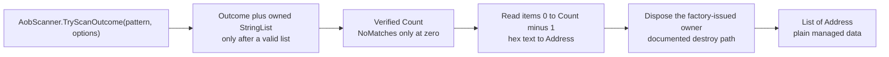

<div align="center">

# 05 · AOB scans

**Find a byte signature in a running process, list every match, and patch code that moves between game updates.**

**Level** `Intermediate` · **Time** `30 min` · **Needs** `Guide 04`

[Examples index](../README.md) · [Previous: Memory](../04-memory/README.md) · [Next: Value scans](../06-value-scans/README.md)

</div>

---

|                            |                                                                                                 |
|----------------------------|-------------------------------------------------------------------------------------------------|
| **You build**              | A "Signature Tools" plugin with a signature finder and a patcher                                |
| **You learn**              | Signature syntax, protection flags, reading a Cheat Engine list object safely, and unique scans |
| **You need**               | [04 · Memory](../04-memory/README.md) for `Address` and the binding pattern                     |
| **Cheat Engine functions** | `AOBScan`, `AOBScanUnique`, `AOBScanModuleUnique`, `autoAssemble`                               |

## Objective

Search the memory of the open process for an array of bytes, with wildcards. You get every match as a list of
`Address` values, or the first match inside one module, and you use the result to patch code.

## Why it matters

A hard coded address breaks with every game update, while the instruction that reads the health rarely changes. A
byte signature finds that instruction again at runtime, so a plugin survives updates that would kill an address table.

`AOBScan` has a second trap. It returns a Cheat Engine list object, and the caller must free it. Forget the `destroy`
and the list leaks. Use the list after it is freed and Cheat Engine crashes. The SDK factory returns the explicit owner;
the scanner below copies the addresses into ordinary managed data and disposes that owner in the same block, so the
native object never leaves the method.

## How it works

### 1. Write a signature

A signature is a string of hexadecimal bytes. `??` matches any byte, so you keep the bytes that identify the code and
wildcard the bytes that change between builds.

| Piece    | Meaning                   | Example             |
|----------|---------------------------|---------------------|
| Hex byte | Matches exactly that byte | `89 83`             |
| `??`     | Matches any byte          | `89 83 ?? ?? 00 00` |

The optional arguments narrow the search:

| Argument            | Values                                                                                                                                                                                     | Example                       |
|---------------------|--------------------------------------------------------------------------------------------------------------------------------------------------------------------------------------------|-------------------------------|
| Protection flags    | Three letters, `X` executable, `W` writable and `C` copy on write. Each one takes a prefix: `+` must be set, `-` must not be set, `*` does not matter. An empty string searches everything | `+X-C-W` finds read only code |
| Alignment type      | `0` no check, `1` the address is divisible by the parameter, `2` the address ends with the parameter                                                                                       | `1`                           |
| Alignment parameter | Text: the divisor for type 1, the last digits for type 2                                                                                                                                   | `"4"`                         |

Empty strings and `0` are valid values. Pass them explicitly when you have nothing to say.

### 2. Bind the unique scans and the assembler

`AOBScanUnique` and `AOBScanModuleUnique` return one integer address, or `nil` when nothing matches. That fits a Try
form exactly. The same file binds `autoAssemble`, which the patcher uses.

```csharp
using CheatEngine.SDK.Annotations.Lua;

namespace SignatureTools;

internal static partial class SignatureCalls
{
    [LuaGlobal("AOBScanUnique")]
    public static partial bool TryScanUnique(string pattern, out nuint address);

    [LuaGlobal("AOBScanUnique")]
    public static partial bool TryScanUnique(
        string pattern, string protection, int alignmentType, string alignmentParam, out nuint address);

    [LuaGlobal("AOBScanModuleUnique")]
    public static partial bool TryScanModuleUnique(string moduleName, string pattern, out nuint address);

    [LuaGlobal("AOBScanModuleUnique")]
    public static partial bool TryScanModuleUnique(
        string moduleName, string pattern, string protection, int alignmentType, string alignmentParam,
        out nuint address);

    [LuaGlobal("autoAssemble")]
    public static partial bool AutoAssemble(string script);
}
```

### 3. Scan for every match

`AOBScan` returns a `StringList` that CE documents as caller-owned. `AobScanner.TryScanOutcome` is the sourced Engine
factory for that contract. It calls a scan synchronously, returns an `Owned<StringList>` only after a successful
protected call, and reports `NoMatches` only when it can read a valid list count of zero. It deliberately keeps raw
Lua `nil`, a missing global, a protected Lua failure, malformed userdata, and an unreadable list count separate;
plugin code must not turn a raw `CEObject` into an owner itself.

```csharp
using CheatEngine.SDK.Engine.Scanning.Aob;
using CheatEngine.SDK.Engine.Values;

namespace SignatureTools;

internal static class Signatures
{
    public static List<Address> Scan(string pattern, AobScanOptions options = default)
    {
        List<Address> matches = [];
        var outcome = AobScanner.TryScanOutcome(pattern, options, out var owner);
        if (outcome.Kind == AobScanOutcomeKind.NoMatches) return matches;
        if (outcome.Kind != AobScanOutcomeKind.Matches || owner is null)
            throw new InvalidOperationException($"AOBScan did not produce a list: {outcome.Kind} ({outcome.LuaStatus}).");

        using (owner)
        {
            var list = owner.Value;

            for (var i = 0; i < outcome.ResultCount; i++)
            {
                if (list.TryGetItem(i, out var addressText) && Address.TryParse(addressText, out var address))
                    matches.Add(address);
            }
        }

        return matches;
    }
}
```



| Step                         | Why                                                                                                              |
|------------------------------|------------------------------------------------------------------------------------------------------------------|
| `AobScanner.TryScanOutcome`  | Performs the protected CE call, distinguishes no-match from failure, and provides an owner only for a valid list |
| `Owned<StringList>`          | Is the factory-issued ownership proof; `Dispose` executes the documented destroy path once                       |
| `AobScanOutcome.ResultCount` | Is the valid list count observed immediately after CE returns; it is not an execution bound                      |
| `StringList.TryGetItem(i)`   | Uses Cheat Engine's zero-based index and copies one address string                                               |
| `Address.TryParse`           | Decodes CE's hexadecimal address text into the target-address type                                               |
| `using (owner)`              | Releases the list before it can escape as a stale native handle                                                  |

### 4. Export it and patch with it

```csharp
using CheatEngine.SDK.Annotations.Lua;
using CheatEngine.SDK.Annotations.Plugin;
using CheatEngine.SDK.Engine.Values;
using CheatEngine.SDK.Hosting.Plugin;
using CheatEngine.SDK.Lua.Runtime;

namespace SignatureTools;

[CheatEnginePlugin("Signature Tools")]
public sealed class SignatureToolsPlugin : CheatEnginePlugin
{
    protected override void OnEnable()
    {
        var status = SignatureFunctions.RegisterLuaFunctions(LuaRuntime.AcquireState());
        if (!status.IsOk) throw new InvalidOperationException($"Lua registration failed: {status}.");
    }

    protected override void OnDisable() => SignatureFunctions.UnregisterLuaFunctions(LuaRuntime.AcquireState());
}

internal static partial class SignatureFunctions
{
    [LuaFunction("my_plugin_find_signature")]
    public static string Find(string pattern)
    {
        var matches = Signatures.Scan(pattern);
        return matches.Count switch
        {
            0 => "no match",
            1 => $"unique match at {matches[0]}",
            _ => $"{matches.Count} matches, first at {matches[0]}",
        };
    }

    [LuaFunction("my_plugin_patch")]
    public static string? Patch(string moduleName, string signature, string bytes)
    {
        if (!SignatureCalls.TryScanModuleUnique(moduleName, signature, out var raw)) return null;

        var address = Address.FromUInt64(raw);
        return RunPatchScript(address, bytes) ? address.ToString() : null;
    }

    [LuaFunction("my_plugin_write_bytes")]
    public static bool WriteBytes(string address, string bytes)
    {
        return Address.TryParse(address, out var target) && RunPatchScript(target, bytes);
    }

    private static bool RunPatchScript(Address address, string bytes)
    {
        var script = $"""
            [ENABLE]
            {address:X}:
              db {bytes}
            [DISABLE]
            """;
        return SignatureCalls.AutoAssemble(script);
    }
}
```

`my_plugin_find_signature` is the health check for a signature: it says how many matches exist. `my_plugin_patch`
finds the signature inside one module and writes new bytes at the match through an Auto Assembler script. It returns
the address it patched, and `my_plugin_write_bytes` writes bytes at any address, so the original bytes can go back.

### 5. Call it from Lua

```lua
print(my_plugin_find_signature("89 83 ?? ?? 00 00"))
local where = my_plugin_patch("game.exe", "89 83 ?? ?? 00 00", "90 90 90 90 90 90")
print(where)
print(my_plugin_write_bytes(where, "89 83 A4 00 00 00"))
```

| Lua call                                                      | Result                                                                                                           |
|---------------------------------------------------------------|------------------------------------------------------------------------------------------------------------------|
| `my_plugin_find_signature(pattern)`                           | `no match`, `unique match at 00007FF6A1DC4F10`, or `3 matches, first at 00007FF6A1DC4F10`                        |
| `my_plugin_patch("game.exe", signature, "90 90 90 90 90 90")` | The patched address such as `00007FF6A1DC4F10`, or `nil` when the module scan found nothing or the script failed |
| `my_plugin_write_bytes(address, "89 83 A4 00 00 00")`         | `true` when the script ran. `false` when the address text is not hexadecimal                                     |

## Unique is not proof

`AOBScanUnique` returns the first result it finds. It does not check that the pattern is the only one, so an ambiguous
pattern hands you whichever match the scanner meets first. Treat `AOBScanModuleUnique` the same way. To prove a
signature, run the full `Signatures.Scan` and require a count of one, which is what `my_plugin_find_signature` reports.

A signature that survives updates follows a few habits:

| Habit                                                                          | Why                                                                                   |
|--------------------------------------------------------------------------------|---------------------------------------------------------------------------------------|
| Keep the opcode bytes and wildcard displacements and absolute addresses        | Offsets and addresses move between builds, and opcodes rarely do                      |
| Use twelve or more bytes with several fixed anchors                            | A short pattern matches unrelated code                                                |
| Use `AOBScanModuleUnique` only when its separate raw CE binding is appropriate | It narrows that raw CE primitive but does not prove uniqueness or extend `AobScanner` |
| Add `+X` when the target is code                                               | Data that happens to hold the same bytes is skipped                                   |
| Check the count after every game update                                        | A count other than one means the signature drifted                                    |

> [!WARNING]
> A patch writes into the target process. Try it on a disposable process first, keep the original bytes next to the new
> ones, and write them back with `my_plugin_write_bytes` when you are done.

## Good to know

- **Lifetime and thread.** Dispose the factory-issued owner before disable, on the host thread required by its ownership
  contract. The AOB catalog itself does not prove a CE GUI-thread rule; use the guarded `MainThread.Invoke` boundary
  when the surrounding feature requires the captured enable thread
  (see [09 · The main thread](../09-main-thread/README.md)).
- **A scan takes time.** `AobScanner` performs a synchronous CE call. Its documented options are protection and
  alignment only; it does not expose a verified range/module restriction, early stop, result limit, or cancellation
  control. A Client can cancel before admission or cap its own copied entries after the call, but neither action stops
  CE scan work. No CE timing or performance claim is made here without a controlled live probe.
- **Nothing found is a fact, not a fallback.** A valid empty `StringList` becomes `NoMatches`. Raw `nil`, missing
  `AOBScan`, a protected Lua error, malformed userdata, and an unreadable count are not no-match and should follow
  the caller's explicit diagnostic or retry policy.
- **The object never escapes.** The list lives only inside `Scan`. Do not return the `CEObject` or keep it across calls.

## Promise

- The list object is destroyed exactly once, on every path that received one.
- A failed protected Lua call becomes a structured `ProtectedLuaFailure` and never leaves an error value on the Lua
  stack.
- The Lua stack returns to its previous height after every scan.
- The result is plain `Address` data, so it stays valid after the list is gone.

## Before you move on

- [ ] `my_plugin_find_signature` reports a count of one for the signature you plan to ship.
- [ ] The patch and its undo both run on a disposable process.
- [ ] Your own scan code never returns or stores a `CEObject`.

---

<div align="center">

[Examples index](../README.md) · **Next:** [06 · Value scans](../06-value-scans/README.md)

</div>
