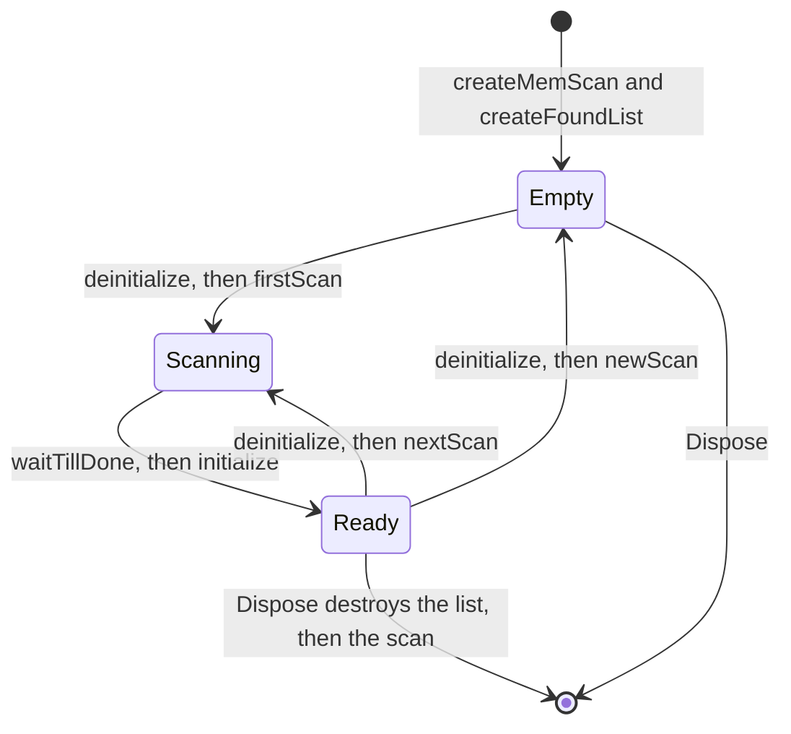

<div align="center">

# 06 · Value scans

**Run first and next scans from C#, read the candidates, and free the scan objects exactly once.**

**Level** `Intermediate` · **Time** `35 min` · **Needs** `Guide 05`

[Examples index](../README.md) · [Previous: AOB scans](../05-aob-scans/README.md) · [Next: The address list](../07-address-list/README.md)

</div>

---

|                            |                                                                                                                                                                                                        |
|----------------------------|--------------------------------------------------------------------------------------------------------------------------------------------------------------------------------------------------------|
| **You build**              | A `ValueScanner` that owns one scan session, and a plugin that drives it from Lua                                                                                                                      |
| **You learn**              | The scan lifecycle, owning two Cheat Engine objects, calling methods with many arguments, enum arguments as numbers                                                                                    |
| **You need**               | [05 · AOB scans](../05-aob-scans/README.md) for the object call pattern                                                                                                                                |
| **Cheat Engine functions** | `createMemScan`, `createFoundList`, and the scan object members `firstScan`, `nextScan`, `newScan`, `waitTillDone`, plus the result list members `initialize`, `deinitialize`, `Count` and its indexer |

## Objective

Find the address of a value the way Cheat Engine's own scanner does: scan for a value, change it in the game, scan
again, and read the addresses that survive. You drive the scan from C# and keep every Cheat Engine object under control.

## Why it matters

A scan session is a small state machine built from two Cheat Engine objects, a scan and a result list. The order of the
calls matters. Read results while a scan is still running and you get half a list. Destroy and recreate the result list
between a first scan and a next scan and Cheat Engine's internal result ownership can break, which can crash the host.
`ValueScanner` puts the order in one place, so a caller cannot get it wrong.

## How it works

### 1. Learn the lifecycle



Each rule below is a line of code in the scanner.

| Rule                                                       | Why                                                                                         |
|------------------------------------------------------------|---------------------------------------------------------------------------------------------|
| Create the scan and its result list together and keep both | Cheat Engine ties result ownership to that one list object                                  |
| Call `deinitialize` on the list before every scan          | A scan rewrites the results, so the list must let go of them first                          |
| Call `waitTillDone` before you read anything               | Results are incomplete while the scan runs                                                  |
| Call `initialize` on the same list after the scan          | It opens the fresh results for reading                                                      |
| Never destroy and recreate the list between scans          | This can break Cheat Engine's result ownership and crash the host                           |
| Destroy the list only when you dispose the scan            | The list belongs to the scan for its whole life                                             |
| Dispose on the main thread, before `OnDisable` returns     | After that `Dispose` cannot reach Cheat Engine, and the objects leak                        |
| Never destroy the scan of the Cheat Engine window          | `getCurrentMemscan` returns Cheat Engine's own object. Create your own with `createMemScan` |

### 2. Write the scanner

```csharp
using CESDK.Engine.Enums;
using CESDK.Engine.Objects;
using CESDK.Engine.Values;
using CESDK.Lua.Calls;
using CESDK.Lua.Marshalling;
using CESDK.Lua.Runtime;
using CESDK.Lua.State;

namespace ScanTools;

internal sealed class ValueScanner : IDisposable
{
    private readonly Owned<CEObject> _scan;
    private readonly Owned<CEObject> _results;
    private bool _disposed;

    public ValueScanner()
    {
        var L = LuaRuntime.AcquireState();
        using LuaFrame frame = new(L);

        L.TryGetGlobal("createMemScan"u8).ThrowIfFailed(L);
        L.TryCall(0, 1).ThrowIfFailed(L);
        _scan = Own(L);

        try
        {
            L.TryGetGlobal("createFoundList"u8).ThrowIfFailed(L);
            _scan.Value.Push(L);
            L.TryCall(1, 1).ThrowIfFailed(L);
            _results = Own(L);
        }
        catch
        {
            _scan.Dispose();
            throw;
        }
    }

    public int Count =>
        !_disposed && _results.Value.TryGetProperty<Int32Marshaller, int>("Count"u8, out var count) ? count : 0;

    public void FirstScan(VariableType type, string value)
    {
        ObjectDisposedException.ThrowIf(_disposed, this);
        Call(_results.Value, "deinitialize"u8);

        var L = LuaRuntime.AcquireState();
        using LuaFrame frame = new(L);
        EnumMarshaller<ScanOption>.Push(L, ScanOption.ExactValue);
        EnumMarshaller<VariableType>.Push(L, type);
        EnumMarshaller<RoundingType>.Push(L, RoundingType.Rounded);
        StringMarshaller.Push(L, value);
        StringMarshaller.Push(L, string.Empty);
        AddressMarshaller.Push(L, 0);
        AddressMarshaller.Push(L, nuint.MaxValue);
        StringMarshaller.Push(L, string.Empty);
        EnumMarshaller<FastScanMethod>.Push(L, FastScanMethod.Aligned);
        StringMarshaller.Push(L, AlignmentFor(type));
        for (var i = 0; i < 4; i++) BooleanMarshaller.Push(L, false);
        _scan.Value.TryCallMethod(L, "firstScan"u8, 14, 0).ThrowIfFailed(L);

        Call(_scan.Value, "waitTillDone"u8);
        Call(_results.Value, "initialize"u8);
    }

    public void NextScan(ScanOption option, string value)
    {
        ObjectDisposedException.ThrowIf(_disposed, this);
        Call(_results.Value, "deinitialize"u8);

        var L = LuaRuntime.AcquireState();
        using LuaFrame frame = new(L);
        EnumMarshaller<ScanOption>.Push(L, option);
        EnumMarshaller<RoundingType>.Push(L, RoundingType.Rounded);
        StringMarshaller.Push(L, value);
        StringMarshaller.Push(L, string.Empty);
        for (var i = 0; i < 5; i++) BooleanMarshaller.Push(L, false);
        _scan.Value.TryCallMethod(L, "nextScan"u8, 9, 0).ThrowIfFailed(L);

        Call(_scan.Value, "waitTillDone"u8);
        Call(_results.Value, "initialize"u8);
    }

    public bool TryGetResult(int index, out Address address)
    {
        address = default;
        if (_disposed) return false;

        var L = LuaRuntime.AcquireState();
        using LuaFrame frame = new(L);
        return _results.Value.TryGetIndex(L, index).IsOk && Address.TryRead(L, -1, out address);
    }

    public void Reset()
    {
        ObjectDisposedException.ThrowIf(_disposed, this);
        Call(_results.Value, "deinitialize"u8);
        Call(_scan.Value, "newScan"u8);
    }

    public void Dispose()
    {
        if (_disposed) return;
        _disposed = true;

        _results.Value.TryCallMethod("deinitialize"u8);
        _results.Dispose();
        _scan.Dispose();
    }

    private static Owned<CEObject> Own(LuaState L)
    {
        if (!CEObject.TryRead(L, -1, out var handle))
            throw new InvalidOperationException("Cheat Engine did not return an object.");

        return new Owned<CEObject>(handle);
    }

    private static void Call(CEObject target, ReadOnlySpan<byte> name)
    {
        if (!target.TryCallMethod(name)) throw new InvalidOperationException("A Cheat Engine method call failed.");
    }

    private static string AlignmentFor(VariableType type) => type switch
    {
        VariableType.Word => "2",
        VariableType.Dword or VariableType.Single => "4",
        VariableType.Qword or VariableType.Double => "8",
        _ => "1",
    };
}
```

How the pieces fit:

| Piece                                    | What it does                                                                                                |
|------------------------------------------|-------------------------------------------------------------------------------------------------------------|
| `Owned<CEObject>` twice                  | The scanner created both objects, so it owns both. `Dispose` destroys each one once                         |
| The `try` and `catch` in the constructor | If the list cannot be created, the scan that already exists is destroyed before the exception leaves        |
| `EnumMarshaller<TEnum>.Push`             | Pushes the enum as the number Cheat Engine's `soExactValue` or `vtDword` constant holds                     |
| `TryCallMethod(L, name, 14, 0)`          | Calls the method with the 14 values on top of the stack and keeps no result                                 |
| `AlignmentFor`                           | An aligned scan only looks at addresses divisible by the size of the value, four for a `dword`              |
| `TryGetIndex(L, index)`                  | Reads the result at Cheat Engine's own zero based index, as hexadecimal text that `Address.TryRead` accepts |

> [!NOTE]
> Function arguments take enum values as numbers, which `EnumMarshaller<TEnum>` pushes. Properties that Cheat Engine
> publishes as text, such as `VarType` on a table record, read and write the names instead: `CEEnumNames.ToCEName`
> turns `VariableType.Dword` into `vtDword`. The [address list guide](../07-address-list/README.md) uses the names.

### 3. Export it to Lua

```csharp
using System.Globalization;
using CESDK.Annotations.Lua;
using CESDK.Annotations.Plugin;
using CESDK.Engine.Enums;
using CESDK.Hosting.Plugin;
using CESDK.Lua.Runtime;

namespace ScanTools;

[CheatEnginePlugin("Value Scanner")]
public sealed class ValueScannerPlugin : CheatEnginePlugin
{
    protected override void OnEnable()
    {
        var status = ScanFunctions.RegisterLuaFunctions(LuaRuntime.AcquireState());
        if (!status.IsOk) throw new InvalidOperationException($"Lua registration failed: {status}.");
    }

    protected override void OnDisable()
    {
        ScanFunctions.Shutdown();
        ScanFunctions.UnregisterLuaFunctions(LuaRuntime.AcquireState());
    }
}

internal static partial class ScanFunctions
{
    private static ValueScanner? s_scanner;

    [LuaFunction("my_plugin_scan_first")]
    public static long First(long value)
    {
        s_scanner ??= new ValueScanner();
        s_scanner.FirstScan(VariableType.Dword, value.ToString(CultureInfo.InvariantCulture));
        return s_scanner.Count;
    }

    [LuaFunction("my_plugin_scan_next")]
    public static long Next(long value)
    {
        var scanner = Started();
        scanner.NextScan(ScanOption.ExactValue, value.ToString(CultureInfo.InvariantCulture));
        return scanner.Count;
    }

    [LuaFunction("my_plugin_scan_changed")]
    public static long Changed()
    {
        var scanner = Started();
        scanner.NextScan(ScanOption.Changed, string.Empty);
        return scanner.Count;
    }

    [LuaFunction("my_plugin_scan_count")]
    public static long Count() => s_scanner?.Count ?? 0;

    [LuaFunction("my_plugin_scan_result")]
    public static string? Result(long index)
    {
        return s_scanner is not null && s_scanner.TryGetResult(checked((int)index), out var address)
            ? address.ToString()
            : null;
    }

    [LuaFunction("my_plugin_scan_reset")]
    public static void Reset() => s_scanner?.Reset();

    internal static void Shutdown()
    {
        s_scanner?.Dispose();
        s_scanner = null;
    }

    private static ValueScanner Started()
    {
        return s_scanner ?? throw new InvalidOperationException("Run my_plugin_scan_first before a next scan.");
    }
}
```

`OnDisable` disposes the scanner while the Lua runtime is still attached, then unregisters the functions. That order is
what lets `Dispose` reach Cheat Engine and destroy both objects.

### 4. Find the gold counter

Say a game shows `100` gold. You scan for it, spend ten, and scan for the new amount.

```lua
print(my_plugin_scan_first(100))   -- how many four byte values equal 100
-- spend 10 gold in the game, then:
print(my_plugin_scan_next(90))     -- how many of them now equal 90
print(my_plugin_scan_result(0))    -- the first candidate address, or nil
```

Each `next` scan keeps only the candidates that match, so the count falls. When a handful is left, read them with
`my_plugin_scan_result(index)`, or spend gold again and scan for the new amount. When the value has no number you can
type, use `my_plugin_scan_changed()` after an action that should change it, and repeat until the list is short. Add the
winner to the table with the [address list guide](../07-address-list/README.md).

| Lua call                                                 | Result                                                                           |
|----------------------------------------------------------|----------------------------------------------------------------------------------|
| `my_plugin_scan_first(100)`                              | The number of candidates. It is large on a first scan                            |
| `my_plugin_scan_next(90)` and `my_plugin_scan_changed()` | The number of candidates left                                                    |
| `my_plugin_scan_count()`                                 | The current number of candidates, `0` before the first scan                      |
| `my_plugin_scan_result(0)`                               | An address such as `00007FF6A1DC4F10`, or `nil` when the index is out of range   |
| `my_plugin_scan_reset()`                                 | Clears the results and keeps the objects for the next first scan                 |
| `my_plugin_scan_next(90)` before any first scan          | `System.InvalidOperationException: Run my_plugin_scan_first before a next scan.` |

## Choose the scan option

| `ScanOption`                                               | Works in       | Needs input |
|------------------------------------------------------------|----------------|-------------|
| `UnknownValue`                                             | First scan     | No          |
| `ExactValue`, `BiggerThan`, `SmallerThan`                  | First and next | One value   |
| `ValueBetween`                                             | First and next | Two values  |
| `IncreasedValue`, `DecreasedValue`, `Changed`, `Unchanged` | Next scan      | No          |
| `IncreasedValueBy`, `DecreasedValueBy`                     | Next scan      | One value   |

`ValueScanner.FirstScan` runs an exact value scan to keep the example short. To offer more, add a `ScanOption` argument
and a second input to the same method, and push them in the same positions.

## Promise

- `Owned<T>` destroys its object once, never retries a destroy that raised, and never throws from `Dispose`.
- The scanner calls `deinitialize` before every scan, and `waitTillDone` and `initialize` after it.
- No result list is destroyed or recreated between scans. `Dispose` destroys the list first and the scan second.
- The Lua stack returns to its previous height after every operation.
- The scan of the Cheat Engine window is never touched.

## Before you move on

- [ ] `my_plugin_scan_first` and `my_plugin_scan_next` narrow a value in a disposable game.
- [ ] Unticking the plugin disposes the scanner, and ticking it again starts a fresh one.
- [ ] Your own code never calls `destroy` on a list or a scan that `ValueScanner` owns.

---

<div align="center">

[Examples index](../README.md) · **Next:** [07 · The address list](../07-address-list/README.md)

</div>
