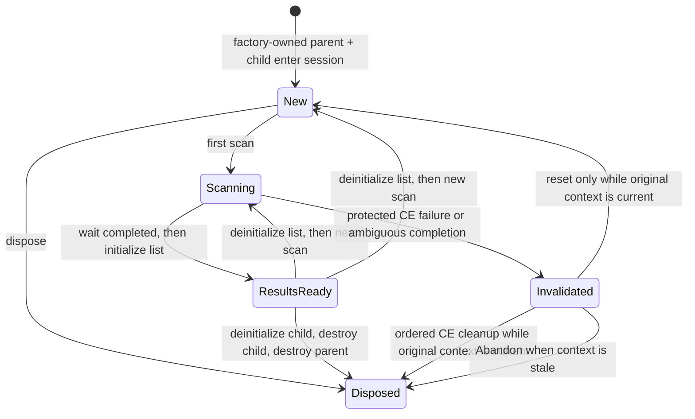

<div align="center">

# 06 · Value scans

**Understand the scan state machine; use the sourced SDK factory and keep Client availability live-gated.**

**Level** `Intermediate` · **Time** `10 min` · **Needs** `Guide 05`

[Examples index](../README.md) · [Previous: AOB scans](../05-aob-scans/README.md) · [Next: The address list](../07-address-list/README.md)

</div>

---

|                          |                                                                                                                                                                                        |
|--------------------------|----------------------------------------------------------------------------------------------------------------------------------------------------------------------------------------|
| **You learn**            | Why a MemScan and its FoundList form one parent/child state machine, and why an object pointer is not enough to establish ownership                                                    |
| **Cheat Engine surface** | `createMemScan`, `createFoundList`, `firstScan`, `nextScan`, `newScan`, `waitTillDone`, `initialize`, and `deinitialize`                                                               |
| **Current SDK boundary** | `MemoryScanSessions.TryCreateDetailed` owns the created parent/child pair and reports factual creation outcomes; Client availability remains deferred pending the CE 7.7 x64 live gate |

## Status

The exact CE 7.7 catalog identifies `createMemScan` and `createFoundList`. The SDK's
`MemoryScanSessions.TryCreateDetailed` is the normal construction path: it creates the pair under one held Lua
operation, owns the returned parent and child immediately, rolls a created parent back if the child cannot be made, and
transfers the pair only into `MemoryScanSession`. Its `MemoryScanCreationStatus` keeps a missing factory, a protected
Lua failure, `nil`, malformed results, an aliased child and unconfirmed rollback distinct. `TryCreate` remains the
boolean compatibility projection of that detailed result. A raw return value is still not a consumer-owned resource:
wrapping it manually could double-destroy a host object or leave a parent with a dangling child.

The session captures the Lua attachment epoch/state generation and a qualified target incarnation before publication.
Every operation checks both facts before touching its CE handles. A changed runtime or target is not repaired by
guessing: normal CE cleanup is refused, and `Abandon()` records the only no-CE recovery path for an owner that can no
longer be safely addressed. This is conservative source/fixture behavior, not a claim that a live host makes every
target switch observable atomically.

This guide intentionally does **not** show a raw Lua call followed by a consumer-created `Owned<T>`. The Client remains
`Unknown`/`Unavailable` until its opt-in CE 7.7 x64 lifecycle scenario validates creation, scan, ordered cleanup,
disable/re-enable and target-change behavior. The low-level factory is necessary for that evidence; it is not itself a
claim that the high-level Client capability is ready.

## The lifecycle the future factory must preserve



| State          | Operations that are safe by the session contract  | Why                                                                                                    |
|----------------|---------------------------------------------------|--------------------------------------------------------------------------------------------------------|
| `New`          | First scan or ordered disposal                    | There is no readable result view yet                                                                   |
| `Scanning`     | Wait for completion or ordered disposal           | The list must not be read while CE updates it                                                          |
| `ResultsReady` | Bounded copy, next scan, reset, or disposal       | The same initialized FoundList represents this completed scan                                          |
| `Invalidated`  | Reset or ordered disposal only if context matches | A protected error leaves native state ambiguous; a stale context instead requires explicit abandonment |

The important order is `deinitialize` before a next scan/reset, and `waitTillDone` followed by `initialize` before
reading. Disposal has to release the child view before destroying the child, then the parent. These are conservative
SDK invariants; they are not a claim that every alternative raw-Lua sequence is rejected by Cheat Engine.

## Factual copies and cooperative cancellation

`TryCopyResults` is the session's non-streaming read boundary. The caller supplies the complete destination span; the
SDK reads the count once and refuses an insufficient buffer before issuing any row calls. It builds a temporary complete
snapshot and publishes it to that span only on success. `NoResults`, `DestinationTooSmall`, malformed host data, Lua
failure, stale context and cancellation are separate `MemoryScanMaterializationStatus` values. Result-cardinality,
progress and retry policy stay in Client rather than becoming SDK policy.

The `*Cancellable` methods observe a `CancellationToken` before a CE call and after a synchronous CE call returns. CE's
documented `waitTillDone()` has no cancellation argument, so a cancellation milestone never claims that native work was
interrupted; it only records whether the SDK observed cancellation before work began or after it had returned.

## Ownership rule

`MemScan` and `FoundList` are borrowed handle types. An explicit `Owned<T>` can only come from an Engine factory whose
documentation cites the exact CE ownership contract. The ownership wrapper—not `class` versus `struct`, and not a
pointer returned from Lua—determines who may destroy the object.

This is the same model used by the completed AOB slice:

```csharp
using CheatEngine.SDK.Engine.Scanning.Aob;

if (AobScanner.TryScan("89 83 ?? ?? 00 00", out var owner) && owner is not null)
{
    using (owner)
    {
        // owner.Value is a borrowed StringList while this factory-issued owner is alive.
    }
}
```

The example is deliberately `StringList`, not a scan workaround. It demonstrates the only supported consumer-side
ownership pattern: obtain a factory-issued owner, borrow `.Value` for operations, and dispose that one owner before
plugin disable. Do not use it to infer that `createMemScan` has the same contract.

## What is still required

The SDK fixture covers factual factory outcomes, alias rejection, publication rollback, ordered child/parent release,
state transitions, pre-call cancellation, bounded copying, and stale runtime/target refusal. Before the Client may
expose a live value-scan capability, the vertical slice still must record an isolated, opt-in CE 7.7 x64 probe covering
success, failure, ordered cleanup, cancellation while a scan is in progress, disable/re-enable and target changes.

The [capability matrix](../../documentations/CheatEngine.SDK/capability-matrix.md) tracks that proof. Until then, use
typed target-memory APIs for scalar reads/writes and `AobScanner` for the ownership-proven AOB result list from the
high-level Client; reserve `MemoryScanSessions.TryCreate` for a deliberately authorized, source-backed SDK experiment.

## Before you move on

- [ ] Do not turn a scan object handle into an owner in consumer code.
- [ ] Keep a scan result list associated with its original scan for its entire lifetime.
- [ ] Treat an error during scan transition as an invalidated session, not as proof that reading can continue.

---

<div align="center">

[Examples index](../README.md) · **Next:** [07 · The address list](../07-address-list/README.md)

</div>
