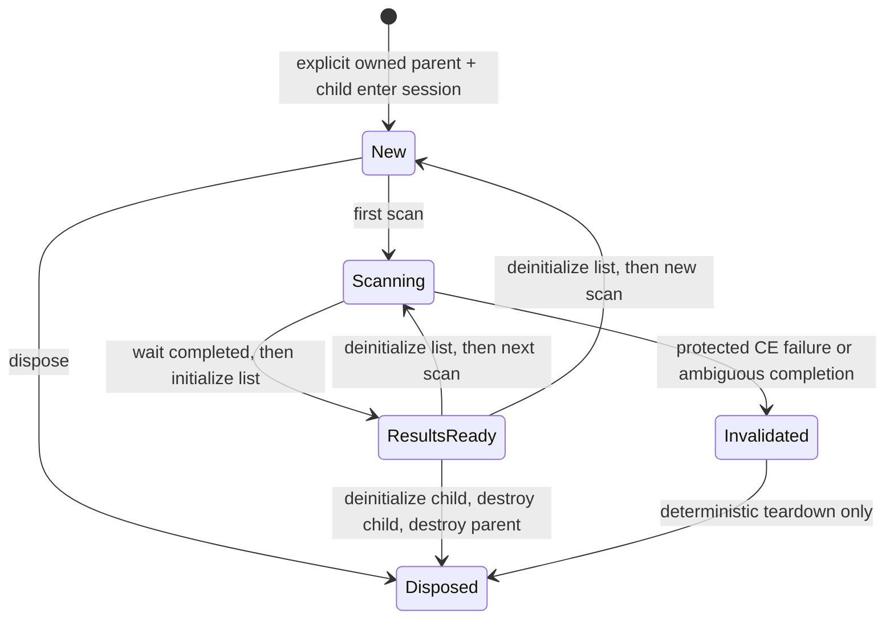

<div align="center">

# 06 · Value scans

**Understand the scan state machine; wait for a sourced ownership factory before creating scan objects.**

**Level** `Intermediate` · **Time** `10 min` · **Needs** `Guide 05`

[Examples index](../README.md) · [Previous: AOB scans](../05-aob-scans/README.md) · [Next: The address list](../07-address-list/README.md)

</div>

---

|                          |                                                                                                                                        |
|--------------------------|----------------------------------------------------------------------------------------------------------------------------------------|
| **You learn**            | Why a MemScan and its FoundList form one parent/child state machine, and why an object pointer is not enough to establish ownership    |
| **Cheat Engine surface** | `createMemScan`, `createFoundList`, `firstScan`, `nextScan`, `newScan`, `waitTillDone`, `initialize`, and `deinitialize`               |
| **Current SDK boundary** | The typed session owns an explicitly transferred parent/child pair; public creation remains deferred pending CE 7.7 ownership evidence |

## Status

The exact CE 7.7 catalog identifies `createMemScan` and `createFoundList`, but it does not by itself prove who must
destroy each returned object or the transfer semantics between the scan, result list, and Cheat Engine. That is a
critical distinction: treating a raw return value as a consumer-owned resource can double-destroy a host object or
leave a parent with a dangling child.

For that reason this guide intentionally does **not** show a raw Lua call followed by a consumer-created `Owned<T>`.
The current scan-session API encodes the lifecycle only after a separately sourced binding has supplied an explicit
parent/child ownership pair. Until the public factory has its CE 7.7 ownership proof, consumer code should not create
or adopt `MemScan`/`FoundList` values directly.

## The lifecycle the future factory must preserve



| State          | Operations that are safe by the session contract | Why                                                                                           |
|----------------|--------------------------------------------------|-----------------------------------------------------------------------------------------------|
| `New`          | First scan or disposal                           | There is no readable result view yet                                                          |
| `Scanning`     | Wait for completion or disposal                  | The list must not be read while CE updates it                                                 |
| `ResultsReady` | Read results, next scan, reset, or disposal      | The same initialized FoundList represents this completed scan                                 |
| `Invalidated`  | Disposal                                         | A protected error leaves the native scan state ambiguous, so the SDK does not invent recovery |

The important order is `deinitialize` before a next scan/reset, and `waitTillDone` followed by `initialize` before
reading. Disposal has to release the child view before destroying the child, then the parent. These are conservative
SDK invariants; they are not a claim that every alternative raw-Lua sequence is rejected by Cheat Engine.

## Ownership rule

`MemScan` and `FoundList` are borrowed handle types. An explicit `Owned<T>` can only come from an Engine factory whose
documentation cites the exact CE ownership contract. The ownership wrapper—not `class` versus `struct`, and not a
pointer returned from Lua—determines who may destroy the object.

This is the same model used by the completed AOB slice:

```csharp
using CheatEngine.SDK.Engine.Scanning.Aob;

if (AobScanner.TryScan("89 83 ?? ?? 00 00", out var owner) && owner is not null)
{
    using (owner)
    {
        // owner.Value is a borrowed StringList while this factory-issued owner is alive.
    }
}
```

The example is deliberately `StringList`, not a scan workaround. It demonstrates the only supported consumer-side
ownership pattern: obtain a factory-issued owner, borrow `.Value` for operations, and dispose that one owner before
plugin disable. Do not use it to infer that `createMemScan` has the same contract.

## What is still required

Before this page gains a working scan-creation example, the vertical slice must record and test:

- whether `createMemScan` and `createFoundList` each transfer ownership to the plugin, and their exact destroy order;
- `nil`, protected-Lua-error, and malformed-result behaviour at every creation and scan transition;
- parent/child invalidation when CE or a user resets/reuses a result list;
- cancellation and disable while CE has a scan in progress;
- the exact thread/lifecycle boundary for the creation and destruction calls; and
- fixture tests plus an isolated, opt-in CE 7.7 live probe.

The [capability matrix](../../documentations/CheatEngine.SDK/capability-matrix.md) tracks that proof. Until then,
use typed target-memory APIs for scalar reads/writes and `AobScanner` for the ownership-proven AOB result list; reserve
direct scan construction for a deliberately authorized, source-backed experiment outside the ordinary SDK path.

## Before you move on

- [ ] Do not turn a scan object handle into an owner in consumer code.
- [ ] Keep a scan result list associated with its original scan for its entire lifetime.
- [ ] Treat an error during scan transition as an invalidated session, not as proof that reading can continue.

---

<div align="center">

[Examples index](../README.md) · **Next:** [07 · The address list](../07-address-list/README.md)

</div>
