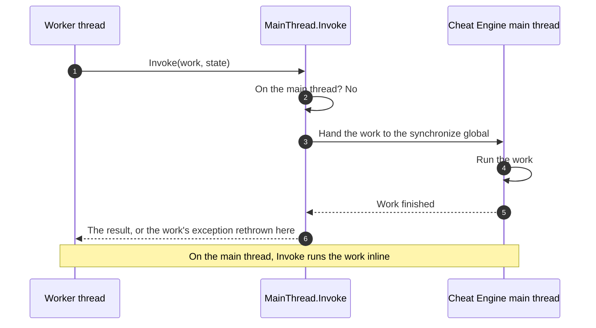

<div align="center">

# 09 · The main thread

**Keep every call into Cheat Engine on the thread it belongs to.**

**Level** `Intermediate` · **Time** `25 min` · **Needs** `Guide 03`

[Examples index](../README.md) · [Previous: Running Lua](../08-running-lua/README.md) · [Next: Logging and errors](../10-logging-and-errors/README.md)

</div>

---

|                            |                                                                                                   |
|----------------------------|---------------------------------------------------------------------------------------------------|
| **You build**              | A value monitor that samples on a worker thread, and a long task that keeps the window responsive |
| **You learn**              | `MainThread.Invoke`, `IsMainThread`, `ProcessMessages`, `CheckSynchronize`, `PluginContext`       |
| **You need**               | The bindings from [03 · Calling Cheat Engine](../03-calling-cheat-engine/README.md)               |
| **Cheat Engine functions** | `getAddressSafe`, `readInteger`, `print`, and the `synchronize` route used by `MainThread.Invoke` |

## Objective

Run background work without breaking Cheat Engine. A worker thread samples a value, reports it through Cheat Engine, and
stops cleanly when the plugin is disabled.

## Why it matters

Treat Cheat Engine's Lua state, engine objects, scanners, and windows as main-thread-only. A call from another thread
can corrupt them. The SDK gives worker code one bounded synchronous route, `MainThread`, so it need not touch Cheat
Engine directly. The exact CE 7.7 behavior of `synchronize` — execution thread, error/return propagation, and
re-entrance — remains an opt-in live-probe gate. The SDK guards the route mechanically; it does not convert that
pending host evidence into a universal CE promise.

## Where your code runs

| Code                                                                        | Thread                                                                 |
|-----------------------------------------------------------------------------|------------------------------------------------------------------------|
| `OnEnable` and `OnDisable`                                                  | The captured enable thread; treated as the plugin main-thread boundary |
| A `[LuaFunction]` called from the Lua Engine window or a cheat table script | Do not assume a thread: protect the work with the same boundary        |
| A thread you start: `Thread`, `Task.Run`, a timer callback                  | Not the captured enable thread unless you explicitly dispatch          |



`MainThread.Invoke` runs your work inline when you are already on the captured enable thread. From another thread it
uses Cheat Engine's Lua `synchronize` global and waits for completion. Its callback thunk checks that the host really
called it on that captured thread; a mismatch rejects the work rather than executing it on a worker. The implementation
does not expose `queue(function, ...)`, because that CE API does not have a proven argument/return contract here. Until
the live probe completes, this is a guarded SDK mechanism, not evidence that every CE 7.7 host schedules it as shown.

## How it works

### 1. Bind what the monitor needs

```csharp
using CheatEngine.SDK.Annotations.Lua;

namespace ValueMonitor;

internal static partial class Ce
{
    [LuaGlobal("getAddressSafe")]
    public static partial bool TryGetAddress(string name, out nuint address);

    [LuaGlobal("print")]
    public static partial void Print(string text);
}
```

### 2. Sample on a worker, report through the main thread

```csharp
using CheatEngine.SDK.Annotations.Lua;
using CheatEngine.SDK.Annotations.Plugin;
using CheatEngine.SDK.Engine.Generated;
using CheatEngine.SDK.Engine.Values;
using CheatEngine.SDK.Hosting.Diagnostics;
using CheatEngine.SDK.Hosting.Plugin;
using CheatEngine.SDK.Hosting.Threading;
using CheatEngine.SDK.Lua.Runtime;

namespace ValueMonitor;

[CheatEnginePlugin("Value Monitor")]
public sealed class ValueMonitorPlugin : CheatEnginePlugin
{
    private CancellationTokenSource? _stop;
    private Thread? _worker;

    protected override void OnEnable()
    {
        var L = LuaRuntime.AcquireState();
        Functions.RegisterLuaFunctions(L).ThrowIfFailed(L);
        Scanner.RegisterLuaFunctions(L).ThrowIfFailed(L);

        _stop = new CancellationTokenSource();
        var token = _stop.Token;
        _worker = new Thread(() => Sample(token)) { IsBackground = true, Name = "Value Monitor" };
        _worker.Start();
    }

    protected override void OnDisable()
    {
        _stop?.Cancel();

        // The worker may be inside MainThread.Invoke, waiting for this very thread. Keep pumping until it ends.
        while (_worker is { } worker && !worker.Join(TimeSpan.Zero)) MainThread.CheckSynchronize(10);

        _stop?.Dispose();
        _stop = null;
        _worker = null;

        var L = LuaRuntime.AcquireState();
        Functions.UnregisterLuaFunctions(L);
        Scanner.UnregisterLuaFunctions(L);
    }

    private static void Sample(CancellationToken token)
    {
        try
        {
            while (!token.IsCancellationRequested)
            {
                var address = Functions.Watched;
                if (address != 0 && MainThread.Invoke(static a => ReadInt32(a), address) is { } value and < 25)
                    MainThread.Invoke(static v => Ce.Print($"Value Monitor: {v} is below the alarm level."), value);

                token.WaitHandle.WaitOne(TimeSpan.FromSeconds(1));
            }
        }
        catch (InvalidOperationException)
        {
            // The plugin was disabled while a call was in flight: nothing left to monitor.
        }
        catch (Exception exception)
        {
            HostLog.Write(HostLogLevel.Error, "The value monitor stopped.", exception);
        }
    }

    private static int? ReadInt32(nuint address) =>
        MemoryScalars.TryReadInt32(Address.FromUInt64(address), out var value) ? value : null;
}

internal static partial class Functions
{
    private static long s_watched;

    public static nuint Watched => (nuint)Interlocked.Read(ref s_watched);

    [LuaFunction("monitor_watch")]
    public static bool Watch(string symbol)
    {
        if (!Ce.TryGetAddress(symbol, out var address)) return false;

        Interlocked.Exchange(ref s_watched, (long)address);
        return true;
    }

    [LuaFunction("monitor_stop")]
    public static void Stop() => Interlocked.Exchange(ref s_watched, 0);
}
```

Try it from the Lua Engine window:

```lua
print(monitor_watch("game.exe+1F4A0"))   -- true, and the worker starts sampling that address
monitor_stop()                            -- the worker keeps running and reads nothing
```

Three details make this safe.

- **`monitor_watch` is called only on the captured enable thread in this sample**, so it may call `getAddressSafe`
  directly. It hands the worker a plain number through `Interlocked`, never a Cheat Engine object.
- **Every worker read goes through `Invoke`.** `MemoryScalars.TryReadInt32` runs Lua, so the worker calls it as guarded
  work for the captured thread and gets the `int?` back as the result.
- **The worker catches everything.** An exception that escapes a thread you started ends the process. The
  `InvalidOperationException` branch is the normal ending: `Invoke` throws it once the plugin is disabled.

> [!WARNING]
> Never block the captured enable thread on a worker that calls `Invoke`. The worker waits for that thread and the
> thread waits for the worker. When it must wait, as in `OnDisable` above, use `MainThread.CheckSynchronize(timeout)`
> to pump the host queue. This deadlock-avoidance shape is tested against the SDK boundary; its exact CE 7.7 queue and
> re-entrance behavior remains part of the opt-in live probe.

### 3. Keep the window alive during a long task

```csharp
using CheatEngine.SDK.Annotations.Lua;
using CheatEngine.SDK.Engine.Generated;
using CheatEngine.SDK.Engine.Values;
using CheatEngine.SDK.Hosting.Bootstrap;
using CheatEngine.SDK.Hosting.Threading;

namespace ValueMonitor;

internal static partial class Scanner
{
    [LuaFunction("my_plugin_count_matches")]
    public static long CountMatches(long start, long length, int target)
    {
        var context = PluginHost.Context;
        long matches = 0;

        for (long offset = 0; offset < length; offset += 4)
        {
            if (MemoryScalars.TryReadInt32(Address.FromInt64(start + offset), out var value) && value == target)
                matches++;

            if ((offset & 0xFFF) != 0) continue;

            MainThread.ProcessMessages();
            if (context is null || !context.IsCurrent) break;
        }

        return matches;
    }
}
```

This function counts the 32-bit values equal to `target` in a range. It is designed to run on the captured enable
thread, so a long loop could freeze Cheat Engine's window. Every 1,024 reads it calls `MainThread.ProcessMessages()`,
which invokes the host's message-pump slot.

Treat `ProcessMessages` as re-entrant: message handlers can execute within the call. The user might therefore untick
the plugin in the middle of the loop. The loop keeps the `PluginContext` it started with and stops as soon as
`IsCurrent` turns `false`, which is how it notices a disable or a re-enable. The precise CE 7.7 GUI scheduling remains
unverified live.

### 4. A helper that reads like a block

```csharp
using CheatEngine.SDK.Hosting.Threading;

namespace ValueMonitor;

internal static class Sync
{
    public static void Run(Action work) => MainThread.Invoke<Action>(static run => run(), work);

    public static T Run<T>(Func<T> work) => MainThread.Invoke<Func<T>, T>(static run => run(), work);
}
```

`MainThread.Invoke` takes a state argument so that the lambda can be `static` and capture nothing. When a closure is
simpler than the state, this helper passes the delegate itself as the state:

```csharp
Sync.Run(() => Ce.Print("hello from any thread"));
var moduleBase = Sync.Run(() => Ce.TryGetAddress("game.exe", out var address) ? address : 0);
```

## The rules

| Rule                                                       | Why                                                                     | Where you saw it                                |
|------------------------------------------------------------|-------------------------------------------------------------------------|-------------------------------------------------|
| Treat CE state, objects and scanners as main-thread-only   | Their CE 7.7 thread contract is not yet proven by the live probe        | `Invoke` around `ReadInt32`                     |
| Reach the captured thread only through `MainThread.Invoke` | It is the guarded synchronous hop, inline when you are already there    | Steps 2 and 4                                   |
| Keep a check and the action it guards in the same `Invoke` | Another thread can change Cheat Engine between two hops                 | One `ReadInt32` call, one hop                   |
| Catch every exception on a thread you start                | An escaped exception ends the process                                   | `Sample`                                        |
| Pump when the captured thread waits or works long          | It exercises the host queue/message slots; model re-entrance explicitly | `OnDisable` and `CountMatches`                  |
| Stop your threads in `OnDisable`                           | After it returns, `Invoke` and the Lua state are gone                   | `_stop.Cancel()` and `Join`                     |
| Dispose an `Owned<T>` on the main thread                   | `Dispose` calls the object's `destroy()`                                | See [05 · AOB scans](../05-aob-scans/README.md) |

## Facts about the thread and the plugin

`PluginContext` holds the immutable facts of one enable and is safe to read from any thread. Get it from
`CheatEnginePlugin.Context` between the start of `OnEnable` and the end of `OnDisable`, or from `PluginHost.Context`,
which returns `null` while the plugin is disabled.

| Member                                      | Meaning                                                    |
|---------------------------------------------|------------------------------------------------------------|
| `PluginId`                                  | The id Cheat Engine assigned in the enable callback        |
| `Epoch`                                     | The runtime epoch of this enable. Every enable advances it |
| `MainThreadId`                              | The managed thread id captured by the enable callback      |
| `IsMainThread`                              | Whether the calling thread is the main thread              |
| `IsCurrent`                                 | Whether this is still the context of the current enable    |
| `HasProcessMessages`, `HasCheckSynchronize` | Whether the host supplied the two message loop slots       |

`MainThread.IsMainThread` reads the same captured fact and is `false` while the plugin is disabled. Keep no
`PluginContext` and no Lua reference across a disable: the next enable publishes a new context and a new Lua identity,
and `IsCurrent` tells the old context from the live one.

The attributes now have specific consumers; they are not one blanket compile-time enforcement mechanism. The Lua
generator propagates `[LuaClass]`, `[LuaMethod]`, and `[LuaProperty]` contracts into protected bindings;
`[RequiresPluginEnabled]` informs `CESDK1001` for constructor/initializer use; `[CEOwned]` informs the direct-dispose
rule `CESDK1003`; and `OnEnable`/`OnDisable` reject `async void`. `[MainThreadOnly]` and `[RunsOnMainThread]` still
state the thread contract on APIs and generated bindings, while a general static `CESDK1002` remains deferred until the
CE 7.7 dispatcher probe validates the host semantics. Runtime guards on `MainThread` remain active regardless.

## What you see when you call too early

`MainThread.Invoke`, `ProcessMessages` and `CheckSynchronize` need an enabled plugin. Calling `my_plugin_count_matches`
while the plugin is disabled raises an ordinary Lua error:

```text
System.InvalidOperationException: The plugin is not enabled: Cheat Engine has not called EnablePlugin, or has called DisablePlugin since.
```

`ProcessMessages` and `CheckSynchronize` also refuse a thread that is not the main thread, with a message that tells you
to use `MainThread.Invoke` to get there. They do not pump a queue that is not theirs. They throw as well when the host
left the function out of its record.

## Promise

- `Invoke` runs inline on the captured enable thread. From another thread its thunk verifies the target thread before it
  runs work, then returns its result or rethrows its exception on the caller.
- `ProcessMessages` and `CheckSynchronize` run only on the captured enable thread and throw `InvalidOperationException`
  elsewhere.
- `MainThread.IsMainThread` is `false`, and `Invoke` throws, whenever the plugin is disabled.
- No exception from your plugin reaches Cheat Engine. `OnEnable` failures are logged and reported as failed calls;
  `OnDisable` failures are logged, then cleanup completes and Cheat Engine records the disabled state.

## Before you move on

- [ ] Every call into Cheat Engine from a thread you started goes through `MainThread.Invoke`, and you keep the CE 7.7
  live-dispatch limitation visible in the feature's deployment/testing plan.
- [ ] Every thread you start ends before `OnDisable` returns, and its loop catches every exception.
- [ ] A main thread that waits for a worker pumps `CheckSynchronize`.

---

<div align="center">

[Examples index](../README.md) · **Next:** [10 · Logging and errors](../10-logging-and-errors/README.md)

</div>
