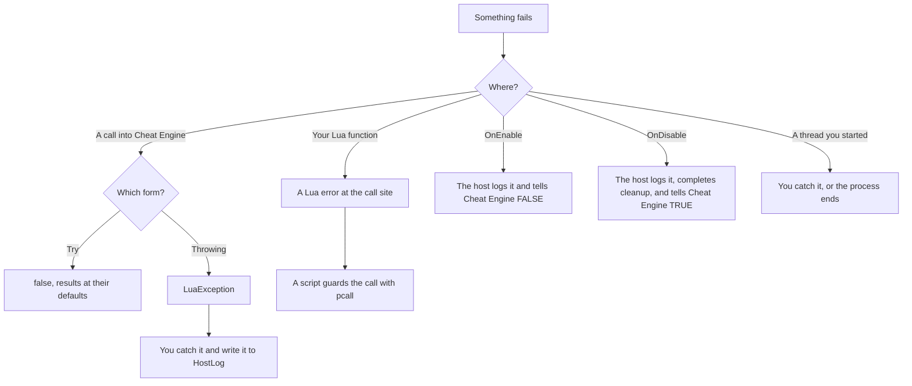

<div align="center">

# 10 · Logging and errors

**See what your plugin does, and know which signal each failure sends.**

**Level** `Beginner` · **Time** `20 min` · **Needs** `Guide 03`

[Examples index](../README.md) · [Previous: The main thread](../09-main-thread/README.md) · [Next: Diagnostics](../11-diagnostics/README.md)

</div>

---

|               |                                                                                                            |
|---------------|------------------------------------------------------------------------------------------------------------|
| **You build** | A log that goes to three places at once: the debugger output, a rolling file and Cheat Engine's Lua output |
| **You learn** | `HostLog`, sinks, levels, and the failure signal of every layer                                            |
| **You need**  | The bindings from [03 · Calling Cheat Engine](../03-calling-cheat-engine/README.md)                        |
| **Covers**    | `HostLog`, `IHostLogSink`, `HostLogLevel`, `DebugOutputLogSink`, `LuaException`, `LuaStatus`               |

## Objective

Route every message and every failure of your plugin to the places you actually read, and pick the right way to report
a problem in each layer.

## Why it matters

Cheat Engine shows nothing when a plugin fails, and an exception that escapes a native callback ends the process. So
the SDK catches every failure at the boundary and writes it to one seam, `HostLog`. You decide where that seam leads.

## How `HostLog` works

| Member                                     | Role                                                                                      |
|--------------------------------------------|-------------------------------------------------------------------------------------------|
| `HostLog.Write(level, message, exception)` | Sends one entry to the current sink. Nothing happens when the level is below the minimum  |
| `HostLog.MinimumLevel`                     | The lowest level that is written. The default is `Information`                            |
| `HostLog.IsEnabled(level)`                 | Whether an entry at that level would be written. Guard costly message building with it    |
| `HostLog.Sink`                             | The destination, an `IHostLogSink`. Assigning `null` restores the default                 |
| `HostLogLevel`                             | `Trace`, `Information`, `Warning`, `Error`. `Trace` adds every lifecycle call of the host |
| `DebugOutputLogSink`                       | The default sink. It writes to the Windows debugger output                                |

The host logs every failure that it turns into `FALSE` or `0` for Cheat Engine, and your own code writes to the same
place. To read the default output, start Sysinternals DebugView, turn on **Capture > Capture Global Win32** and filter
for `CheatEngine.SDK`, or attach a debugger to Cheat Engine. A sink that throws never escapes `HostLog`.

## How it works

### 1. A file that rolls

```csharp
using System.Globalization;
using System.Text;
using CheatEngine.SDK.Hosting.Diagnostics;

namespace LogSinks;

internal sealed class RollingFileSink : IHostLogSink
{
    private readonly Lock _gate = new();
    private readonly string _path;
    private readonly long _maxBytes;
    private readonly int _archives;

    public RollingFileSink(string path, long maxBytes = 10 * 1024 * 1024, int archives = 5)
    {
        ArgumentException.ThrowIfNullOrWhiteSpace(path);
        ArgumentOutOfRangeException.ThrowIfNegativeOrZero(maxBytes);
        ArgumentOutOfRangeException.ThrowIfNegative(archives);

        _path = Path.GetFullPath(path);
        _maxBytes = maxBytes;
        _archives = archives;
        Directory.CreateDirectory(Path.GetDirectoryName(_path)!);
    }

    public void Write(HostLogLevel level, string message, Exception? exception)
    {
        var entry = string.Create(
            CultureInfo.InvariantCulture,
            $"{DateTime.UtcNow:yyyy-MM-dd HH:mm:ss.fff} [{level}] {message}{Environment.NewLine}");
        if (exception is not null) entry += exception + Environment.NewLine;

        lock (_gate)
        {
            Roll(Encoding.UTF8.GetByteCount(entry));
            File.AppendAllText(_path, entry, Encoding.UTF8);
        }
    }

    private void Roll(int incomingBytes)
    {
        var current = new FileInfo(_path);
        if (!current.Exists || current.Length == 0 || current.Length + incomingBytes <= _maxBytes) return;

        if (_archives == 0)
        {
            current.Delete();
            return;
        }

        File.Delete(Archive(_archives));
        for (var index = _archives - 1; index >= 1; index--)
        {
            if (File.Exists(Archive(index))) File.Move(Archive(index), Archive(index + 1));
        }

        File.Move(_path, Archive(1));
    }

    private string Archive(int index) => string.Create(CultureInfo.InvariantCulture, $"{_path}.{index}");
}
```

The defaults keep a 10 MiB file and five archives, `plugin.log.1` to `plugin.log.5`, newest first. Before an entry would
push the file past the limit, the sink shifts every archive up by one, drops the oldest, and starts a fresh file. One
lock covers the roll and the write, so entries from several threads never interleave. With a 200 byte limit and two
archives, twenty short entries end like this:

| File           | Holds                                                                                          |
|----------------|------------------------------------------------------------------------------------------------|
| `plugin.log`   | The newest entries, including `entry 20`                                                       |
| `plugin.log.1` | The entries before them                                                                        |
| `plugin.log.2` | The oldest entries still kept; ordinary entries stay within 200 bytes                    |

Each line has a timestamp in UTC, the level and the message. An exception follows on the next lines, in full:

```text
2026-09-19 14:02:11.482 [Warning] Could not open game.exe.
CheatEngine.SDK.Lua.Calls.LuaException: <the message Cheat Engine raised>
```

### 2. Write to several places, and to Cheat Engine's output

```csharp
using CheatEngine.SDK.Hosting.Diagnostics;

namespace LogSinks;

internal sealed class TeeSink(params IHostLogSink[] sinks) : IHostLogSink
{
    public void Write(HostLogLevel level, string message, Exception? exception)
    {
        foreach (var sink in sinks)
        {
            try
            {
                sink.Write(level, message, exception);
            }
            catch (Exception)
            {
                // One broken destination must not silence the others.
            }
        }
    }
}
```

```csharp
using CheatEngine.SDK.Annotations.Lua;
using CheatEngine.SDK.Hosting.Bootstrap;
using CheatEngine.SDK.Hosting.Diagnostics;
using CheatEngine.SDK.Hosting.Threading;

namespace LogSinks;

internal static partial class Ce
{
    [LuaGlobal("print")]
    public static partial void Print(string text);

    [LuaGlobal("openProcess")]
    public static partial void OpenProcess(string processName);
}

internal sealed class LuaOutputSink : IHostLogSink
{
    public void Write(HostLogLevel level, string message, Exception? exception)
    {
        if (!PluginHost.IsEnabled) return;

        MainThread.Invoke(static line => Ce.Print(line), $"[{level}] {message}");
    }
}
```

`TeeSink` forwards an entry to every sink and isolates their failures. `LuaOutputSink` prints to the Lua Engine output
through the Lua `print` global. A log call can come from any thread, and Cheat Engine's Lua belongs to the main thread,
so the sink goes through `MainThread.Invoke` (see [09 · The main thread](../09-main-thread/README.md)). It also stays
silent while the plugin is disabled, because no Lua state exists then.

### 3. Install the sinks in `OnEnable`

```csharp
using CheatEngine.SDK.Annotations.Plugin;
using CheatEngine.SDK.Hosting.Diagnostics;
using CheatEngine.SDK.Hosting.Plugin;
using CheatEngine.SDK.Lua.Calls;

namespace LogSinks;

[CheatEnginePlugin("Trainer Log")]
public sealed class TrainerLogPlugin : CheatEnginePlugin
{
    protected override void OnEnable()
    {
        var folder = Path.Combine(Environment.GetFolderPath(Environment.SpecialFolder.ApplicationData), "TrainerLog");

        HostLog.Sink = new TeeSink(
            DebugOutputLogSink.Instance,
            new RollingFileSink(Path.Combine(folder, "plugin.log")),
            new LuaOutputSink());
        HostLog.MinimumLevel = HostLogLevel.Information;

        HostLog.Write(HostLogLevel.Information, $"Trainer Log enabled as plugin {Context.PluginId}.");
    }

    protected override void OnDisable()
    {
        HostLog.Write(HostLogLevel.Information, "Trainer Log disabled.");
        HostLog.Sink = DebugOutputLogSink.Instance;
    }

    public static bool TryOpen(string processName)
    {
        try
        {
            Ce.OpenProcess(processName);
            return true;
        }
        catch (LuaException exception)
        {
            HostLog.Write(HostLogLevel.Warning, $"Could not open {processName}.", exception);
            return false;
        }
    }
}
```

After the plugin is enabled, every host message and every `HostLog.Write` of yours reaches all three places:

| Destination     | Read it in                                                                        |
|-----------------|-----------------------------------------------------------------------------------|
| Debugger output | DebugView, filtered for `CheatEngine.SDK`, or a debugger attached to Cheat Engine |
| Rolling file    | `%APPDATA%\TrainerLog\plugin.log`                                                 |
| Lua output      | The Lua Engine window                                                             |

Restore the default sink in `OnDisable` so that the next enable starts from a known state.

> [!TIP]
> Raise the detail while you investigate with `HostLog.MinimumLevel = HostLogLevel.Trace`. The host then logs every
> lifecycle call as well, which shows every step of an enable and a disable.

## Which signal each layer sends



| Layer                                    | Signal                                                                           | What you do                                                                                 |
|------------------------------------------|----------------------------------------------------------------------------------|---------------------------------------------------------------------------------------------|
| `[LuaGlobal]` Try form                   | `false`                                                                          | Treat it as a normal outcome, such as an unreadable address                                 |
| `[LuaGlobal]` throwing form              | `LuaException` with the cause in `Message`                                       | Catch it where you can recover or add context, and log it                                   |
| `LuaState` members that start with `Try` | A `LuaStatus` and one error value                                                | Read the text with `LuaError.FromStack`, or throw with `status.ThrowIfFailed(L)`            |
| `CEObject` typed members                 | `false`                                                                          | Check the result, like any Try form                                                         |
| A `[LuaFunction]` body that throws       | A Lua error such as `System.DivideByZeroException: Attempted to divide by zero.` | Validate arguments for a friendlier message, and log inside the method if you want a record |
| `OnEnable` throws                        | The host logs the exception, and Cheat Engine is told the enable failed          | Throw on purpose when setup cannot finish                                                   |
| `OnDisable` throws                       | Logged; cleanup completes and Cheat Engine records the disabled state            | Avoid it. Release what you own first                                                        |
| A thread you started                     | Nothing catches it, and the process ends                                         | Catch every exception at the top of the thread                                              |

A `[LuaFunction]` failure reaches the script that called it and is not written to `HostLog` by itself.

> [!NOTE]
> `LuaException.Status` carries the `LuaStatus` of the failed call. `LuaStatus` names `Ok`, `RuntimeError`,
> `SyntaxError`, `MemoryError`, `MessageHandlerError`, `GcMetamethodError`, `FileError` and `Yield`.

### What to catch

- Catch `LuaException`, and only that, around a throwing form where you can recover, as `TryOpen` does.
- Catch `Exception` only at a boundary: the top of a thread, a timer callback, or code that native code calls. The
  generated Lua thunks already do this for you.
- Do not catch and ignore. Log with `HostLog.Write(level, message, exception)` so the entry keeps the stack trace.
- Log at the edges of an operation, not at every step, and use `HostLog.IsEnabled(level)` before you build a costly
  message.

## Promise

- No exception from your plugin reaches Cheat Engine: `OnEnable`, `OnDisable` and every generated thunk catch, log and
  report a failed call.
- A sink that throws never escapes `HostLog`, and `TeeSink` keeps the other destinations alive.
- `RollingFileSink` treats its limit as a rotation threshold, keeps at most the configured number of archives, and
  writes whole entries when several threads log at once. One oversized entry is intentionally not split and can exceed
  the threshold in its fresh file.
- `HostLog.MinimumLevel` decides what is written, and `IsEnabled` answers the same question before you build a message.

## Before you move on

- [ ] `plugin.log` appears under `%APPDATA%\TrainerLog` after you enable the plugin.
- [ ] A failed `TryOpen("missing.exe")` writes a `Warning` entry with the exception text.
- [ ] Every thread you start catches `Exception` at its top level and writes it to `HostLog`.

---

<div align="center">

[Examples index](../README.md) · **Next:** [11 · Diagnostics](../11-diagnostics/README.md)

</div>
