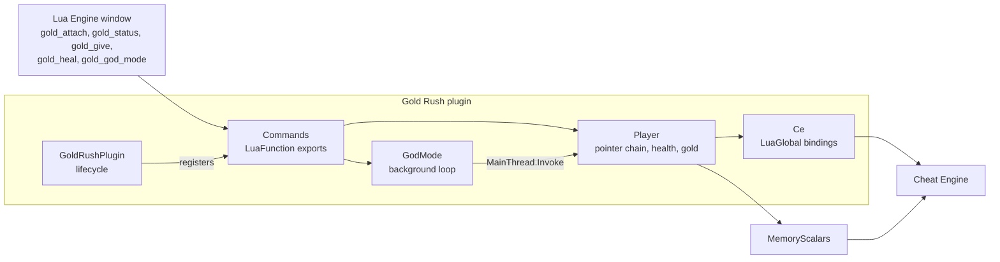

<div align="center">

# 12 · Gold Rush, a complete trainer

**Five small files that combine the lifecycle, typed calls, a pointer chain and a safe background loop.**

**Level** `Advanced` · **Time** `30 min` · **Needs** `Guides 02 to 09`

[Examples index](../README.md) · [Previous: Diagnostics](../11-diagnostics/README.md) · [Next: Recipes](../recipes/README.md)

</div>

---

|                            |                                                                                                                                                            |
|----------------------------|------------------------------------------------------------------------------------------------------------------------------------------------------------|
| **You build**              | A trainer for a fictional game, `game.exe`, with five Lua commands                                                                                         |
| **You learn**              | How the pieces fit: registration, bindings, a pointer chain, a worker that hops to the main thread, a clean shutdown                                       |
| **You need**               | The plugin project of [01](../01-first-plugin/README.md), and the ideas of guides [02](../02-lua-functions/README.md) to [09](../09-main-thread/README.md) |
| **Cheat Engine functions** | `openProcess`, `getOpenedProcessID`, `getAddressSafe`, `readQword`, `readInteger`, `writeInteger`                                                          |

## Objective

Ship one plugin that a player can drive from the Lua Engine window: attach to the game, read health and gold, add gold,
heal, and hold health at its maximum in the background.

## Why it matters

Each guide before this one shows one idea. A real plugin needs them together, and the seams are where mistakes hide: who
owns the worker thread, what happens when the plugin is disabled in the middle of a write, and which layer decides
whether a failure is normal. This trainer is small enough to read in one sitting and complete enough to copy.

> [!NOTE]
> The module name and the offsets belong to a fictional game. Find the real values for your target with
> [05 · AOB scans](../05-aob-scans/README.md) and [06 · Value scans](../06-value-scans/README.md), and change the
> constants in `Player.cs`.

## How the parts fit



```text
GoldRush/
    GoldRush.csproj         the project of guide 01
    GoldRushPlugin.cs       lifecycle: register on enable, stop and unregister on disable
    Ce.cs                   the Cheat Engine functions this plugin calls
    Player.cs               pointer chain and the health and gold operations
    GodMode.cs              the background loop
    Commands.cs             the Lua functions players call
```

## How it works

### 1. The plugin class

**`GoldRushPlugin.cs`**

```csharp
using CESDK.Annotations.Plugin;
using CESDK.Hosting.Diagnostics;
using CESDK.Hosting.Plugin;
using CESDK.Lua.Runtime;

namespace GoldRush;

[CheatEnginePlugin("Gold Rush Trainer")]
public sealed class GoldRushPlugin : CheatEnginePlugin
{
    protected override void OnEnable()
    {
        var status = Commands.RegisterLuaFunctions(LuaRuntime.AcquireState());
        if (!status.IsOk) throw new InvalidOperationException($"Lua registration failed: {status}.");

        HostLog.Write(HostLogLevel.Information, "Gold Rush is ready. Call gold_attach() in the Lua Engine window.");
    }

    protected override void OnDisable()
    {
        Commands.StopGodMode();
        Commands.UnregisterLuaFunctions(LuaRuntime.AcquireState());
    }
}
```

`OnDisable` first stops everything that runs on its own, then removes the Lua globals. Order matters: a loop that
outlives the plugin would call into code that Cheat Engine no longer expects to run.

### 2. The Cheat Engine calls

**`Ce.cs`**

```csharp
using CESDK.Annotations.Lua;

namespace GoldRush;

internal static partial class Ce
{
    [LuaGlobal("openProcess")]
    public static partial void OpenProcess(string processName);

    [LuaGlobal("getOpenedProcessID")]
    public static partial int GetOpenedProcessId();

    [LuaGlobal("getAddressSafe")]
    public static partial bool TryGetAddress(string name, out nuint address);
}
```

`openProcess` is a throwing form, because failing to open the game is worth reporting. `getAddressSafe` is a Try form,
because a module that is not loaded yet is a normal answer.
See [03 · Calling Cheat Engine](../03-calling-cheat-engine/README.md).

### 3. The player

**`Player.cs`**

```csharp
using CESDK.Engine.Generated;
using CESDK.Engine.Values;

namespace GoldRush;

internal static class Player
{
    public const string ProcessName = "game.exe";
    public const int MaxHealth = 999;

    private const long PlayerPointerOffset = 0x1A2B3C;
    private const long HealthOffset = 0x10;
    private const long GoldOffset = 0x14;

    public static bool TryFind(out Address player)
    {
        player = Address.Zero;
        if (!Ce.TryGetAddress(ProcessName, out var moduleBase)) return false;
        if (!MemoryScalars.TryReadInt64(Address.FromUInt64(moduleBase) + PlayerPointerOffset, out var pointer)) return false;
        if (pointer == 0) return false;

        player = Address.FromInt64(pointer);
        return true;
    }

    public static bool TryReadHealth(out int health)
    {
        health = 0;
        return TryFind(out var player) && MemoryScalars.TryReadInt32(player + HealthOffset, out health);
    }

    public static bool TryHeal()
    {
        return TryFind(out var player) && MemoryScalars.WriteInt32(player + HealthOffset, MaxHealth);
    }

    public static bool TryReadGold(out int gold)
    {
        gold = 0;
        return TryFind(out var player) && MemoryScalars.TryReadInt32(player + GoldOffset, out gold);
    }

    public static bool TryAddGold(int amount, out int total)
    {
        total = 0;
        if (!TryFind(out var player)) return false;
        if (!MemoryScalars.TryReadInt32(player + GoldOffset, out var current)) return false;

        total = current + amount;
        return MemoryScalars.WriteInt32(player + GoldOffset, total);
    }
}
```

The player structure moves every time the game restarts, so nothing is cached. `TryFind` follows the pointer chain on
every call: module base, plus a fixed offset, read a pointer, then health and gold at fixed offsets from it. Every step
is a Try form, so an unloaded module, an unreadable pointer and a null player all end the same way, with `false`.
See [04 · Memory](../04-memory/README.md).

### 4. The background loop

**`GodMode.cs`**

```csharp
using CESDK.Hosting.Diagnostics;
using CESDK.Hosting.Threading;

namespace GoldRush;

internal sealed class GodMode
{
    private readonly CancellationTokenSource _cancel = new();
    private readonly Task _loop;

    private GodMode()
    {
        _loop = Task.Run(() => RunAsync(_cancel.Token));
    }

    public static GodMode Start() => new();

    public void Stop()
    {
        _cancel.Cancel();

        // The loop reaches Cheat Engine through MainThread.Invoke, so this thread keeps running the calls
        // that the loop queued for it until the loop has ended.
        while (!_loop.IsCompleted) MainThread.CheckSynchronize(10);

        _cancel.Dispose();
    }

    private static async Task RunAsync(CancellationToken cancellation)
    {
        try
        {
            using PeriodicTimer timer = new(TimeSpan.FromMilliseconds(100));
            while (await timer.WaitForNextTickAsync(cancellation))
            {
                MainThread.Invoke(static _ => { Player.TryHeal(); }, 0);
            }
        }
        catch (OperationCanceledException)
        {
            // Stop() asked for the end.
        }
        catch (Exception exception)
        {
            HostLog.Write(HostLogLevel.Error, "God mode stopped.", exception);
        }
    }
}
```

The loop runs on a worker thread, and every write goes through `MainThread.Invoke`, because Cheat Engine's Lua state
belongs to the main thread. The attachment check and the write happen inside one `Invoke`, inside `Player.TryHeal`.

`Stop` is the part that is easy to get wrong. It runs on the main thread, and the loop may be waiting for that same
thread inside `Invoke`. A plain `Wait()` would freeze both. Pumping `CheckSynchronize` lets the queued call run, the
loop sees the cancellation on its next tick, and `Stop` returns.
See [09 · The main thread](../09-main-thread/README.md).

### 5. The Lua commands

**`Commands.cs`**

```csharp
using CESDK.Annotations.Lua;
using CESDK.Lua.Calls;

namespace GoldRush;

internal static partial class Commands
{
    private static GodMode? s_godMode;

    [LuaFunction("gold_attach")]
    public static string Attach()
    {
        try
        {
            Ce.OpenProcess(Player.ProcessName);
        }
        catch (LuaException exception)
        {
            return $"Could not open {Player.ProcessName}: {exception.Message}";
        }

        if (Ce.GetOpenedProcessId() == 0) return $"{Player.ProcessName} is not running.";

        return Player.TryFind(out var player) ? $"Attached. The player is at {player}." : "Attached, but the player was not found.";
    }

    [LuaFunction("gold_status")]
    public static string Status()
    {
        if (!Player.TryReadHealth(out var health) || !Player.TryReadGold(out var gold)) return "No player: call gold_attach().";

        var godMode = Volatile.Read(ref s_godMode) is null ? "off" : "on";
        return $"Health {health} of {Player.MaxHealth}, gold {gold}, god mode {godMode}.";
    }

    [LuaFunction("gold_give")]
    public static long Give(long amount)
    {
        return Player.TryAddGold(checked((int)amount), out var total) ? total : -1;
    }

    [LuaFunction("gold_heal")]
    public static bool Heal() => Player.TryHeal();

    [LuaFunction("gold_god_mode")]
    public static bool SetGodMode(bool on)
    {
        if (on)
        {
            if (Volatile.Read(ref s_godMode) is not null) return true;
            s_godMode = GodMode.Start();
            return true;
        }

        StopGodMode();
        return false;
    }

    public static void StopGodMode()
    {
        Interlocked.Exchange(ref s_godMode, null)?.Stop();
    }
}
```

The commands answer in plain text and plain values, so a player never sees a stack trace for a normal situation. A game
that is not running, a player that is not found and an unreadable address each have a message or a `-1`.

## Try it

Build the project, add `GoldRush.dll` to Cheat Engine as in [guide 01](../01-first-plugin/README.md), start the game
and run the commands in the Lua Engine window. The values below are the ones the fictional game reports.

```lua
print(gold_status())        -- No player: call gold_attach().
print(gold_attach())        -- Attached. The player is at 02000000.
print(gold_status())        -- Health 450 of 999, gold 1200, god mode off.
print(gold_give(500))       -- 1700
print(gold_heal())          -- true
print(gold_status())        -- Health 999 of 999, gold 1700, god mode off.
print(gold_god_mode(true))  -- true
print(gold_god_mode(false)) -- false
```

## What can go wrong

| Situation                                   | What this plugin does                                                          |
|---------------------------------------------|--------------------------------------------------------------------------------|
| The game is not running                     | `gold_attach` reports it, and `gold_status` says there is no player            |
| The game restarts                           | Nothing is cached, so the next command follows the pointer chain again         |
| A player calls `gold_give("x")`             | Lua reports `bad argument #1 (integer expected, got string)` and keeps running |
| An address is unreadable                    | The Try form returns `false` and the command answers with a message or `-1`    |
| The plugin is disabled while god mode is on | `OnDisable` stops the loop and pumps the main thread until it ends             |
| The loop throws                             | The exception is logged through `HostLog` and the loop ends                    |

## Make it yours

- [ ] Replace the constants in `Player.cs` with the values you find for your target.
- [ ] Find `PlayerPointerOffset` from a byte signature instead of a fixed offset:
  [05 · AOB scans](../05-aob-scans/README.md).
- [ ] Show the values as records in Cheat Engine's table:
  [07 · The address list](../07-address-list/README.md).
- [ ] Send the log to a file: [10 · Logging and errors](../10-logging-and-errors/README.md).
- [ ] Name the addresses with friendly symbols: [Symbols recipe](../recipes/symbols/README.md).

## Promise

- Every Cheat Engine failure the trainer can meet is a value it returns, so no exception reaches Cheat Engine.
- The plugin leaves nothing behind: `OnDisable` ends the loop and removes every Lua global.
- A write from the worker thread runs on Cheat Engine's main thread.
- The trainer never stores a Lua state. Each operation acquires its own.

## Before you move on

- [ ] `dotnet build -c Release` finishes with no warning.
- [ ] `gold_status()` answers before and after `gold_attach()`.
- [ ] Disabling the plugin with god mode on returns at once and leaves no loop running.

---

<div align="center">

[Examples index](../README.md) · **Next:** [Recipes](../recipes/README.md)

</div>
