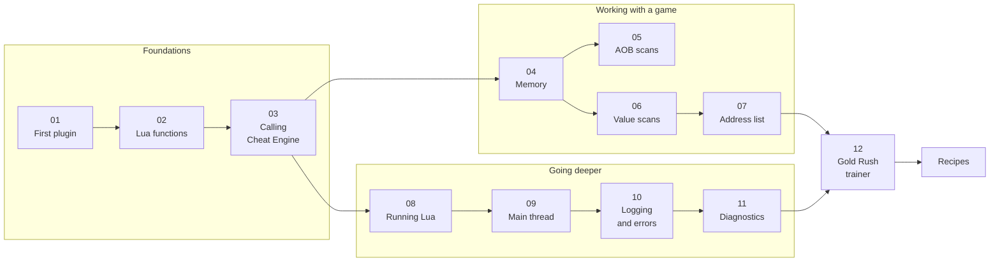

<div align="center">

# CESDK Examples

**Learn to build Cheat Engine plugins in C#, one small and working example at a time.**

`Cheat Engine 7.7` · `.NET 10` · `C# 14` · `Windows x64`

[Start here](#start-here) · [Guides](#guides) · [Recipes](#recipes) · [API guide](api/README.md) · [Complete trainer](12-trainer/README.md)

</div>

---

## What you will find here

Twelve guides that take you from an empty folder to a working trainer, nine recipes for the Cheat Engine features you
reach for next, and one page that maps the whole API. Every page follows the same shape: what you build, why it
matters, the code, what to expect, and what the SDK promises.

|               | Where                                                             | What it gives you                                                                    |
|---------------|-------------------------------------------------------------------|--------------------------------------------------------------------------------------|
| **Guides**    | [`01`](01-first-plugin/README.md) to [`12`](12-trainer/README.md) | A learning path, each step small enough to finish in one sitting                     |
| **Recipes**   | [`recipes/`](recipes/README.md)                                   | One focused solution per Cheat Engine feature: symbols, assembly, debugger, and more |
| **API guide** | [`api/`](api/README.md)                                           | Every type a plugin author touches, in the order you meet it                         |

## Start here

A plugin is one class and one attribute. This is the whole of [guide 01](01-first-plugin/README.md):

```csharp
using CESDK.Annotations.Lua;
using CESDK.Annotations.Plugin;
using CESDK.Hosting.Plugin;
using CESDK.Lua.Runtime;

namespace MyPlugin;

[CheatEnginePlugin("My Plugin")]
public sealed class HelloPlugin : CheatEnginePlugin
{
    protected override void OnEnable() => Commands.RegisterLuaFunctions(LuaRuntime.AcquireState());

    protected override void OnDisable() => Commands.UnregisterLuaFunctions(LuaRuntime.AcquireState());
}

internal static partial class Commands
{
    [LuaFunction("greet")]
    public static string Greet(string name) => $"Hello, {name}!";
}
```

Build it, add the DLL to Cheat Engine, and `print(greet("world"))` in the Lua Engine window answers `Hello, world!`.

> [!TIP]
> New to CESDK? Read guides 01 to 03 in order, then pick the topic you need. Each guide lists what it expects you to
> have read in its `Needs` field.

## Pick your path

| I want to                                              | Go to                                                          |
|--------------------------------------------------------|----------------------------------------------------------------|
| Load my first plugin into Cheat Engine                 | [01 · Your first plugin](01-first-plugin/README.md)            |
| Publish a C# function to Lua                           | [02 · Lua functions](02-lua-functions/README.md)               |
| Call a Cheat Engine function from C#                   | [03 · Calling Cheat Engine](03-calling-cheat-engine/README.md) |
| Read and write a game's memory                         | [04 · Memory](04-memory/README.md)                             |
| Find code that survives a game update                  | [05 · AOB scans](05-aob-scans/README.md)                       |
| Find the address of a value                            | [06 · Value scans](06-value-scans/README.md)                   |
| Build cheat table entries from code                    | [07 · The address list](07-address-list/README.md)             |
| Handle tables, objects and callbacks                   | [08 · Running Lua](08-running-lua/README.md)                   |
| Work in the background without freezing Cheat Engine   | [09 · The main thread](09-main-thread/README.md)               |
| See what my plugin does, and why it failed             | [10 · Logging and errors](10-logging-and-errors/README.md)     |
| Understand a compiler message that starts with `CESDK` | [11 · Diagnostics](11-diagnostics/README.md)                   |
| Read one complete plugin                               | [12 · Gold Rush](12-trainer/README.md)                         |
| Look up a type                                         | [API guide](api/README.md)                                     |

## The learning path



## Guides

| #  | Guide                                                     | Level        | Time   | You build                                                                 |
|----|-----------------------------------------------------------|--------------|--------|---------------------------------------------------------------------------|
| 01 | [Your first plugin](01-first-plugin/README.md)            | Beginner     | 10 min | A plugin that exports one Lua function                                    |
| 02 | [Lua functions](02-lua-functions/README.md)               | Beginner     | 15 min | A game math plugin callable from any cheat table                          |
| 03 | [Calling Cheat Engine](03-calling-cheat-engine/README.md) | Beginner     | 20 min | Typed bindings for the Cheat Engine functions a trainer needs             |
| 04 | [Memory](04-memory/README.md)                             | Beginner     | 25 min | Attach to a game, change a value and follow a pointer chain               |
| 05 | [AOB scans](05-aob-scans/README.md)                       | Intermediate | 30 min | A signature finder and a patcher that survive game updates                |
| 06 | [Value scans](06-value-scans/README.md)                   | Intermediate | 35 min | A scanner that runs first and next scans and reads the candidates         |
| 07 | [The address list](07-address-list/README.md)             | Intermediate | 30 min | A table editor that adds, groups, finds and freezes records               |
| 08 | [Running Lua](08-running-lua/README.md)                   | Intermediate | 30 min | A script runner, a hand written call and a callback that carries state    |
| 09 | [The main thread](09-main-thread/README.md)               | Intermediate | 25 min | A background value monitor that stays safe                                |
| 10 | [Logging and errors](10-logging-and-errors/README.md)     | Beginner     | 20 min | A log that reaches the debugger output, a rolling file and the Lua output |
| 11 | [Diagnostics](11-diagnostics/README.md)                   | Beginner     | 20 min | A gallery of every analyzer rule, broken and fixed                        |
| 12 | [Gold Rush](12-trainer/README.md)                         | Advanced     | 30 min | A complete trainer that combines the guides                               |

## Recipes

Each recipe solves one job with the smallest code that works. They assume guide 03.

| Recipe                                                   | Cheat Engine features                                             |
|----------------------------------------------------------|-------------------------------------------------------------------|
| [Processes](recipes/processes/README.md)                 | Attach, launch, pause and resume, foreground process, modules     |
| [Symbols](recipes/symbols/README.md)                     | Friendly names for addresses, module lookup, waiting for a module |
| [Assembly](recipes/assembly/README.md)                   | Auto Assembler patches, single line assembly, disassembly         |
| [Cheat tables](recipes/cheat-tables/README.md)           | Loading and saving `.CT` files as profiles                        |
| [Debugger](recipes/debugger/README.md)                   | Breakpoints, a hit counter, registers at a hit                    |
| [Injection](recipes/injection/README.md)                 | Remote memory, remote calls, DLL injection                        |
| [Structures](recipes/structures/README.md)               | Defining and listing structure layouts                            |
| [Speed and hashing](recipes/speed-and-hashing/README.md) | Speed control, memory and file hashes                             |
| [DBVM](recipes/dbvm/README.md)                           | Optional hypervisor features with a graceful fallback             |

The [recipe index](recipes/README.md) lists the Cheat Engine functions each one binds.

## How to read these pages

| You see                                            | It means                                                                                                            |
|----------------------------------------------------|---------------------------------------------------------------------------------------------------------------------|
| **Level**, **Time**, **Needs**                     | How hard the page is, how long it takes, and what to read first                                                     |
| A C# block that starts with `using` or `namespace` | A whole file. Add it to a project that references the `CESDK` package, with `ImplicitUsings` and `Nullable` enabled |
| A `lua` block                                      | Something to run in Cheat Engine's Lua Engine window                                                                |
| `Promise`                                          | What the SDK guarantees in that area                                                                                |
| `Before you move on`                               | A short checklist to confirm you are ready for the next page                                                        |

Callouts mark the things worth stopping for:

> [!NOTE]
> Context that helps you decide.

> [!TIP]
> A shortcut or a better way.

> [!IMPORTANT]
> A rule your plugin has to follow.

> [!WARNING]
> A mistake that costs you time.

> [!CAUTION]
> A mistake that can crash Cheat Engine or lose data.

## The rules that keep Cheat Engine alive

Every guide repeats one or more of these. They are worth knowing before you start.

- [ ] Do nothing with the SDK in a constructor, a field initializer or a static constructor. Start in `OnEnable`.
- [ ] Acquire the Lua state once per operation, and never store it.
- [ ] Guard the stack with `using LuaFrame frame = new(state);` when you push values.
- [ ] Touch Cheat Engine only from its main thread, and hop there with `MainThread.Invoke`.
- [ ] Dispose every `Owned<T>` and unregister every function before `OnDisable` returns.
- [ ] Read a Cheat Engine function's exact signature in `celua.txt`, in the Cheat Engine folder, before you bind it.

## Going deeper in the source

Each project of the repository carries a README with its design and guarantees.

| Project                                                                                  | Read it for                                                |
|------------------------------------------------------------------------------------------|------------------------------------------------------------|
| [`src/CESDK`](../src/CESDK/README.md)                                                    | The package: what ships, build properties, requirements    |
| [`libs/CESDK.Hosting`](../libs/CESDK.Hosting/README.md)                                  | The plugin lifecycle, the main thread and logging          |
| [`libs/CESDK.Lua`](../libs/CESDK.Lua/README.md)                                          | The Lua state, protected calls, marshallers and callbacks  |
| [`libs/CESDK.Engine`](../libs/CESDK.Engine/README.md)                                    | Object handles, ownership, addresses and enums             |
| [`source-generators`](../source-generators/CESDK.SourceGenerators.LuaBindings/README.md) | How the generators read your attributes                    |
| [`analyzers`](../analyzers/docs/README.md)                                               | One page per diagnostic                                    |
| [`tests/CESDK.LivePlugin`](../tests/CESDK.LivePlugin/README.md)                          | A plugin to load into Cheat Engine, with the log to expect |

---

<div align="center">

**Ready?** Start with [01 · Your first plugin](01-first-plugin/README.md).

</div>
