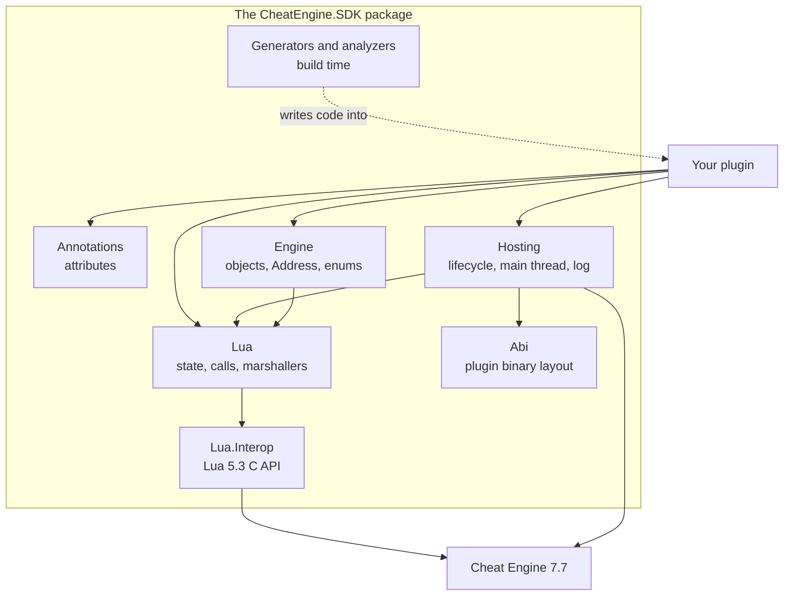
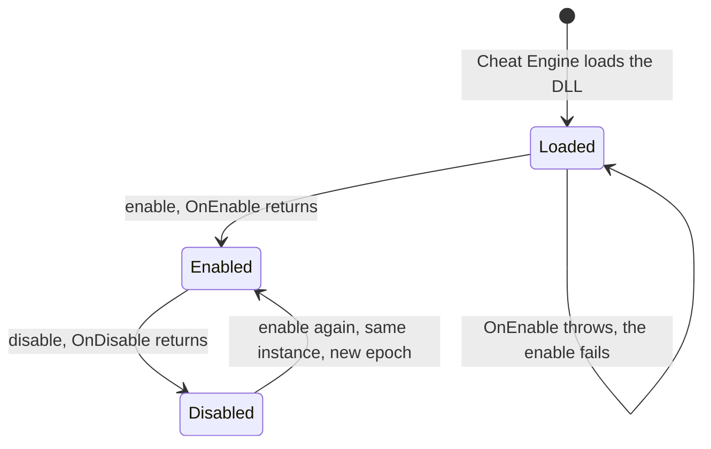

<div align="center">

# The CheatEngine.SDK API, end to end

**Every type a plugin author touches, in the order you meet it, with the rule that keeps Cheat Engine alive.**

**Level** `Reference` · **Time** `Read as needed` · **Needs** `Guide 01`

[Examples index](../README.md) · [Diagnostics](../11-diagnostics/README.md)

</div>

---

**On this page:** [The layers](#the-layers) · [Install](#install-and-build-settings) · [Attributes](#attributes) ·
[Plugin lifecycle](#plugin-lifecycle) · [Generated bindings](#generated-lua-bindings) ·
[Lua toolkit](#the-lua-toolkit) · [Engine](#cheat-engine-objects-and-values) · [Threads](#threads) ·
[Logging](#logging) · [Diagnostics](#diagnostics) · [Cheat sheet](#cheat-sheet)

## The layers

CheatEngine.SDK ships as one NuGet package. Inside it, small libraries stack on each other, and two build time
components write code into your plugin.



| Namespace                                                           | You use it for                                                    | Guide                                                                                                               |
|---------------------------------------------------------------------|-------------------------------------------------------------------|---------------------------------------------------------------------------------------------------------------------|
| `CheatEngine.SDK.Annotations.*`                                     | The attributes the generators and analyzers read                  | [01](../01-first-plugin/README.md), [02](../02-lua-functions/README.md), [03](../03-calling-cheat-engine/README.md) |
| `CheatEngine.SDK.Hosting.Plugin`                                    | The `CheatEnginePlugin` base class                                | [01](../01-first-plugin/README.md)                                                                                  |
| `CheatEngine.SDK.Hosting.Context`, `.Bootstrap`                     | `PluginContext` and the `PluginHost` readers                      | [09](../09-main-thread/README.md)                                                                                   |
| `CheatEngine.SDK.Hosting.Threading`                                 | `MainThread`                                                      | [09](../09-main-thread/README.md)                                                                                   |
| `CheatEngine.SDK.Hosting.Diagnostics`                               | `HostLog` and log sinks                                           | [10](../10-logging-and-errors/README.md)                                                                            |
| `CheatEngine.SDK.Lua.State`, `.Runtime`, `.Calls`                   | `LuaState`, `LuaFrame`, `LuaRuntime`, `LuaStatus`, `LuaException` | [08](../08-running-lua/README.md)                                                                                   |
| `CheatEngine.SDK.Lua.Marshalling`, `.References`, `.Callbacks`      | Marshallers, `LuaRef`, `LuaCallback`                              | [08](../08-running-lua/README.md)                                                                                   |
| `CheatEngine.SDK.Engine.Objects`, `.Values`, `.Enums`, `.Generated` | `CEObject`, `Owned<T>`, `Address`, enums, `MemoryScalars`         | [04](../04-memory/README.md) to [07](../07-address-list/README.md)                                                  |

`CheatEngine.SDK.Abi` (the packed init record and host function table) and `CheatEngine.SDK.Lua.Interop` (the raw
Lua 5.3 C API) are the foundation. A plugin author rarely calls them, and `CheatEngine.SDK.Lua.CompilerServices` is
called by generated code only.

## Install and build settings

```powershell
dotnet add package CheatEngine.SDK --prerelease
```

| Setting                            | Default from the package | Meaning                                                                                 |
|------------------------------------|--------------------------|-----------------------------------------------------------------------------------------|
| `AllowUnsafeBlocks`                | `true` while empty       | The Lua binding generator takes the address of native thunks and needs it (`CESDK2001`) |
| `EnableDynamicLoading`             | `true` while empty       | Copies referenced assemblies next to your plugin and writes its runtime config          |
| `CheatEngineSdkGenerateEntryPoint` | `true` while empty       | Set `false` to write `CESDK.CESDK.CEPluginInitialize` by hand                           |
| `PlatformTarget`                   | yours                    | Must not be `x86`: the build stops with `CESDK9101`                                     |

| Requirement  | Version                                                                                               |
|--------------|-------------------------------------------------------------------------------------------------------|
| .NET SDK     | 10.0.401 or later (older compilers report `CS9057` and skip the generators)                           |
| Runtimes     | .NET 10 `Microsoft.NETCore.App`, `Microsoft.WindowsDesktop.App`, `Microsoft.AspNetCore.App`           |
| Cheat Engine | 7.7 on Windows x64, with `ce.runtimeconfig.json` explicitly requesting .NET 10 for every framework entry (see [01](../01-first-plugin/README.md)) |

## Attributes

| Attribute                              | Namespace   | On                                | Meaning                                                       |
|----------------------------------------|-------------|-----------------------------------|---------------------------------------------------------------|
| `CheatEnginePlugin(name)`              | `Plugin`    | class                             | This class is the plugin, listed under `name`                 |
| `LuaFunction(name)`                    | `Lua`       | static method                     | Export the method as the Lua global `name`                    |
| `LuaGlobal(name)`                      | `Lua`       | static partial method             | Generate a typed call into the Cheat Engine Lua global `name` |
| `LuaClass`, `LuaMethod`, `LuaProperty` | `Lua`       | type, method, property            | Document which Cheat Engine class member a wrapper stands for |
| `LuaStackEffect(delta)`                | `Lua`       | method                            | The method changes the Lua stack height by `delta`            |
| `MainThreadOnly`                       | `Threading` | member or type                    | Callers must run on Cheat Engine's main thread                |
| `RunsOnMainThread`                     | `Threading` | method                            | The body runs on the main thread and restricts no caller      |
| `RequiresPluginEnabled`                | `Lifetime`  | member or type                    | The API works only between enable and disable                 |
| `CEOwned`                              | `Lifetime`  | return value, property, parameter | Cheat Engine owns the object: do not dispose it               |

All namespaces start with `CheatEngine.SDK.Annotations.`. The last five attributes are metadata: they document intent
for you and for tools, and the SDK applies them to its own APIs.

## Plugin lifecycle

`CheatEngine.SDK.Hosting.Plugin.CheatEnginePlugin` is the base class. Mark one subclass with
`[CheatEnginePlugin("Name")]`, give it a public parameterless constructor, and override two methods.

| Member        | Kind                                       | Notes                                                                                                                |
|---------------|--------------------------------------------|----------------------------------------------------------------------------------------------------------------------|
| `OnEnable()`  | abstract, override as `protected override` | Runs on the main thread with the Lua runtime attached. Register functions, create objects. Throwing fails the enable |
| `OnDisable()` | abstract, override as `protected override` | Runs on the main thread while the runtime is still usable. Release everything `OnEnable` created                     |
| `Context`     | `protected static`                         | The `PluginContext` of this enable. Throws while the plugin is disabled                                              |

`PluginContext` holds immutable facts of one enable, and you may read it from any thread.

| Member                                                             | Meaning                                                                       |
|--------------------------------------------------------------------|-------------------------------------------------------------------------------|
| `PluginId`                                                         | The id Cheat Engine assigned in the enable callback                           |
| `Epoch`                                                            | Advances with every enable. A value kept from an earlier epoch is stale       |
| `MainThreadId`, `IsMainThread`                                     | The managed id of Cheat Engine's main thread, and whether the caller is on it |
| `IsCurrent`                                                        | Whether this context is the live one                                          |
| `ReportedExportsSize`, `HasProcessMessages`, `HasCheckSynchronize` | What the host reported, for diagnostics                                       |

`PluginHost` (`CheatEngine.SDK.Hosting.Bootstrap`) exposes lock free readers: `IsInitialized`, `IsEnabled`, `Context`
(`null` while disabled), `LastInitRecordSize` and `LastVersionRecordSize`.



> [!IMPORTANT]
> The instance is created on the first enable, before the Lua runtime attaches. A constructor, a field initializer or a
> static constructor that calls the SDK throws. The same instance serves every later enable, so keep per enable state in
> `OnEnable` and release it in `OnDisable`.

## Generated Lua bindings

`[LuaFunction]` exports C# to Lua and `[LuaGlobal]` imports Cheat Engine's Lua functions into C#. Both need a `partial`
containing type chain.

| Lua type | C# types               | Allowed as                                |
|----------|------------------------|-------------------------------------------|
| integer  | `int`, `long`, `nuint` | Arguments and results                     |
| number   | `float`, `double`      | Arguments and results                     |
| boolean  | `bool`                 | Arguments and results                     |
| string   | `string`, `string?`    | Arguments and results                     |
| string   | `ReadOnlySpan<byte>`   | Arguments, and results of `[LuaFunction]` |

| Generated member                      | Where                                       | Returns                                 |
|---------------------------------------|---------------------------------------------|-----------------------------------------|
| `RegisterLuaFunctions(LuaState)`      | The type that holds `[LuaFunction]` methods | `LuaStatus`                             |
| `UnregisterLuaFunctions(LuaState)`    | The same type                               | `LuaStatus`, assigns `nil` to each name |
| The body of each `[LuaGlobal]` method | The type that declares it                   | Depends on the form below               |

| `[LuaGlobal]` form | Shape                                          | On failure                                     |
|--------------------|------------------------------------------------|------------------------------------------------|
| Try                | `bool` result, then `out` results              | `false`, results at defaults                   |
| Throwing           | `void` or one value                            | `LuaException`                                 |
| Boolean throwing   | `bool` result and no `out`                     | Reads a Lua boolean, `LuaException` on failure |
| Copy out           | `..., Span<byte> destination, out int written` | `false`, also when the buffer is too small     |

A leading `LuaState` parameter replaces `LuaRuntime.AcquireState()` in a `[LuaGlobal]` method and receives the callback
state in a `[LuaFunction]` method. A `[LuaFunction]` cannot be generic, `async`, or take `params`, defaults or `ref`
parameters. Read the full rules in the [Lua functions guide](../02-lua-functions/README.md) and the
[Cheat Engine calls guide](../03-calling-cheat-engine/README.md).

## The Lua toolkit

`CheatEngine.SDK.Lua` is what generated code calls, and what you call when a binding cannot express the job.

### Runtime and state

| Type         | Members                                                                                                            |
|--------------|--------------------------------------------------------------------------------------------------------------------|
| `LuaRuntime` | `AcquireState()`, `TryAcquireState(out state)`, `IsAttached`, `Epoch`, `IsMainThread`                              |
| `LuaState`   | A borrowed view of a `lua_State*`. Never store it, acquire one per operation                                       |
| `LuaFrame`   | `using LuaFrame frame = new(state);` restores the stack top on every exit. Also `Top`, `Count`, `AssertBalanced()` |

### `LuaState` members

| Group                 | Members                                                                                                                                                                                                           |
|-----------------------|-------------------------------------------------------------------------------------------------------------------------------------------------------------------------------------------------------------------|
| Push                  | `PushNil`, `PushInteger`, `PushNumber`, `PushBoolean`, `PushLightUserdata`, `PushGlobalTable`, `PushString` (UTF-8 bytes or chars)                                                                                |
| Read                  | `TryReadInteger`, `TryReadNumber`, `ToBoolean`, `TryReadUtf8`, `TryCopyUtf8`, `TryReadString`, `ToUserdata`, `ToPointer`, `RawLength`                                                                             |
| Stack                 | `Top`, `SetTop`, `Pop`, `PushValue`, `AbsoluteIndex`, `TryEnsureStack`, `Insert`, `Remove`, `Replace`, `Copy`, `Rotate`                                                                                           |
| Types                 | `TypeOf`, `TypeName`, `IsInteger`, `IsNumberConvertible`, `IsNil`, `IsNone`, `IsNoneOrNil`, `IsFunction`, `IsTable`, `IsUserdata`, `IsLightUserdata`                                                              |
| Raw tables            | `CreateTable`, `RawGet`, `RawGetIndex`, `RawGetPointer`, `TryRawSet`, `RawSetIndex`, `RawSetPointer`, `RawEquals`, `TryGetMetatable`, `SetMetatable`, `NewUserdata`                                               |
| Protected             | `TryCall`, `TryLoad`, `TryExecute`, `TryGetGlobal`, `TrySetGlobal`, `TryGetField`, `TrySetField`, `TryGetTable`, `TrySetTable`, `TryGetIndex`, `TrySetIndex`, `TryLength`, `TryToString`, `TryCompare`, `TryNext` |
| References, callbacks | `CreateRef`, `TryPushRef`, `TryPushFunction`, `PushUncheckedFunction`                                                                                                                                             |

Raw members make one or two C calls and never run Lua code. Protected members run under `lua_pcallk`, return a
`LuaStatus`, and on failure leave exactly one error value on the stack. There is no unprotected form of a call.

### Results and errors

| Type                       | Role                                                                                                                     |
|----------------------------|--------------------------------------------------------------------------------------------------------------------------|
| `LuaStatus`                | The result of a protected operation: `IsOk`, `Code`, and the named values `Ok`, `RuntimeError`, `SyntaxError` and others |
| `LuaError`                 | `LuaError.FromStack(state, status)` reads the message of a failed operation without running Lua                          |
| `LuaException`             | Thrown by throwing forms. `Status`, `Message`. `LuaException.ThrowFromStack(state, status)` raises it from a status      |
| `LuaType`, `LuaComparison` | Type tags from `TypeOf`, and the operator for `TryCompare`                                                               |

### Marshallers, references and callbacks

| Type                                                                                              | Role                                                                                                  |
|---------------------------------------------------------------------------------------------------|-------------------------------------------------------------------------------------------------------|
| `Int32Marshaller`, `Int64Marshaller`, `SingleMarshaller`, `DoubleMarshaller`, `BooleanMarshaller` | `Push(state, value)` and `TryRead(state, index, out value)` for one type each                         |
| `StringMarshaller`, `Utf8Marshaller`, `AddressMarshaller`                                         | Text as `string`, text as UTF-8 span, an address as `nuint`                                           |
| `EnumMarshaller<TEnum>`, `ILuaMarshaller<T>`                                                      | Enums as Lua integers, and the contract every marshaller implements                                   |
| `LuaRef`                                                                                          | A registry reference stamped with an epoch: `IsResolved`, `IsCurrent`, `Release(state)`               |
| `LuaCallback`, `LuaCallback<TState>`, `LuaNativeFunction`, `LuaThunk`                             | A managed function Lua can call with a state object: `TryCreate`, `TryPush`, `TryRegister`, `Release` |

Every marshaller pushes exactly one value. Use them as the `TMarshaller` argument of the typed `CEObject` members below.

## Cheat Engine objects and values

### `CEObject`

A `readonly struct` that is the native object pointer and nothing else. It is a borrowed handle: equal by identity, with
no `Dispose`.

| Member                                                                         | Meaning                                                     |
|--------------------------------------------------------------------------------|-------------------------------------------------------------|
| `Value`, `IsNull`, `Null`                                                      | The pointer, the null test, and the null handle             |
| `TryRead(state, index, out handle)`                                            | Decode a handle from a full userdata on the stack           |
| `Push(state)`                                                                  | Push the object back through the host                       |
| `TryGetProperty<TMarshaller, TValue>(name, out value)`                         | Read `obj.Name`. `false` for nil or a wrong kind            |
| `TrySetProperty<TMarshaller, TValue>(name, value)`                             | Write `obj.Name = value`                                    |
| `TryCallMethod(name)`, `TryCallMethod<TMarshaller, TResult>(name, out result)` | Call `obj.name()` with no arguments                         |
| `TryPushMethod(state, name)`, `TryCallMethod(state, name, argc, resc)`         | Stack level calls with arguments                            |
| `TryGetIndex(state, i)`, `TrySetIndex(state, i)`                               | Read or write `obj[i]` with Cheat Engine's zero based index |

Property names, method names and arguments are UTF-8 spans: write `"Count"u8`.

### `Owned<T>`

Ownership of an object your plugin created. `Dispose()` calls `destroy()` on the main thread and never throws. There
is no finalizer, so dispose every `Owned<T>` before `OnDisable` returns. `Release()` gives up ownership without
destroying, `ToBorrowed()` returns the handle, `TryDestroy(state)` reports the status, and `IsDisposed` tells the state.
Wrap only what a `create*` call returned, never what Cheat Engine owns (`getAddressList()`, `getCurrentMemscan()`).

### `Address`

A 64-bit address value. It parses hexadecimal text (optional `0x`, no sign) or a Lua integer, and it round trips values
above `long.MaxValue`.

| Member                                                                                 | Meaning                                                                            |
|----------------------------------------------------------------------------------------|------------------------------------------------------------------------------------|
| `new Address(ulong)`, `Address.FromUInt64`, `Address.FromInt64`, implicit from `ulong` | Construction                                                                       |
| `Value`, `IsZero`, `Zero`, `ToUInt64()`, `ToInt64()`, explicit to `ulong`              | Reading it back                                                                    |
| `+`, `-` with a `long`, `Add`, `Subtract`                                              | Offsets                                                                            |
| `==`, `!=`, `<`, `>`, `<=`, `>=`, `CompareTo`                                          | Ordering                                                                           |
| `TryParse` (UTF-8, chars, string), `Parse`                                             | Hexadecimal text in                                                                |
| `ToString()`, `ToString(format, provider)`, `TryFormat`                                | Uppercase hexadecimal: eight digits when the value fits 32 bits, sixteen otherwise |

### Indices and sequences

Every public index in CheatEngine.SDK is zero based. Cheat Engine's own objects count from zero and a Lua table counts
from one, and the only `+ 1` lives in `IndexBase.ToLuaKey`. The extensions on `LuaState` for a table on the stack are
`RawSequenceCount`, `RawGetSequenceItem`, `RawSetSequenceItem`, `TryGetSequenceItem` and `TrySetSequenceItem`.

### Enums

Function arguments take the number, and RTTI properties of an object take the name. `CEEnumNames.ToCEName(value)`
returns the Cheat Engine name as UTF-8 (empty for an undefined value or a flag combination), and
`TryParseCEName` reverses it.

| Enum                       | Members (value, Cheat Engine name)                                                                                                                                                                                    |
|----------------------------|-----------------------------------------------------------------------------------------------------------------------------------------------------------------------------------------------------------------------|
| `VariableType`             | `Byte` 0 `vtByte`, `Word` 1, `Dword` 2, `Qword` 3, `Single` 4, `Double` 5, `String` 6, `WideString` 7, `ByteArray` 8, `Binary` 9, `All` 10, `AutoAssembler` 11, `Pointer` 12, `Custom` 13, `Grouped` 14               |
| `ScanOption`               | `UnknownValue` 0 `soUnknownValue`, `ExactValue` 1, `ValueBetween` 2, `BiggerThan` 3, `SmallerThan` 4, `IncreasedValue` 5, `IncreasedValueBy` 6, `DecreasedValue` 7, `DecreasedValueBy` 8, `Changed` 9, `Unchanged` 10 |
| `RoundingType`             | `Rounded` 0 `rtRounded`, `ExtremeRounded` 1 `rtExtremerounded`, `Truncated` 2 `rtTruncated`                                                                                                                           |
| `FastScanMethod`           | `NotAligned` 0 `fsmNotAligned`, `Aligned` 1 `fsmAligned`, `LastDigits` 2 `fsmLastDigits`                                                                                                                              |
| `BreakpointMethod`         | `Int3` 0 `bpmInt3`, `DebugRegister` 1 `bpmDebugRegister`, `Exception` 2 `bpmException`                                                                                                                                |
| `BreakpointTrigger`        | `Execute` 0 `bptExecute`, `Access` 1 `bptAccess`, `Write` 2 `bptWrite`                                                                                                                                                |
| `ContinueMethod`           | `Run` 0 `co_run`, `StepInto` 1 `co_stepinto`, `StepOver` 2 `co_stepover`                                                                                                                                              |
| `MemoryProtection` (flags) | `ReadOnly` 2, `ReadWrite` 4, `WriteCopy` 8, `Execute` 16, `ExecuteRead` 32, `ExecuteReadWrite` 64, `ExecuteWriteCopy` 128 (`PAGE_*` names)                                                                            |
| `DuplicateHandling`        | `Ignore` 0 `dupIgnore`, `Accept` 1 `dupAccept`, `Error` 2 `dupError`                                                                                                                                                  |

### `MemoryScalars`

`CheatEngine.SDK.Engine.Generated.MemoryScalars` wraps four Cheat Engine functions with `Address` arguments.

| Method                             | Cheat Engine function | On failure                                                             |
|------------------------------------|-----------------------|------------------------------------------------------------------------|
| `TryReadInt32(address, out value)` | `readInteger`         | `false`                                                                |
| `TryReadInt64(address, out value)` | `readQword`           | `false`                                                                |
| `WriteInt32(address, value)`       | `writeInteger`        | Returns Cheat Engine's flag, throws `LuaException` when the call fails |
| `WriteInt64(address, value)`       | `writeQword`          | Same                                                                   |

## Threads

`CheatEngine.SDK.Hosting.Threading.MainThread` is Cheat Engine's main (GUI) thread as a plugin sees it. Everything
needs an enabled plugin.

| Member                                                  | Meaning                                                                                  |
|---------------------------------------------------------|------------------------------------------------------------------------------------------|
| `IsMainThread`                                          | Whether the caller is the main thread. `false` while the plugin is disabled              |
| `Invoke<TState>(Action<TState>, state)`                 | Run work on the main thread and return when it is done. Inline when already there        |
| `Invoke<TState, TResult>(Func<TState, TResult>, state)` | The same, returning the result. An exception from the work is rethrown on the caller     |
| `ProcessMessages()`                                     | Pump the window messages so a long main thread job keeps the GUI alive. Main thread only |
| `CheckSynchronize(timeoutMilliseconds)`                 | Run calls other threads queued for the main thread. Main thread only                     |

Pass what the work needs as `state` so that the lambda can be `static`.
Read [09 · The main thread](../09-main-thread/README.md).

## Logging

`CheatEngine.SDK.Hosting.Diagnostics.HostLog` receives every failure that a lifecycle callback turns into a failed call.

| Member                             | Meaning                                                                                                  |
|------------------------------------|----------------------------------------------------------------------------------------------------------|
| `Write(level, message, exception)` | Write one entry. A throwing sink never escapes                                                           |
| `Sink`                             | An `IHostLogSink`. The default `DebugOutputLogSink` writes to `OutputDebugString`, so DebugView shows it |
| `MinimumLevel`                     | Filter, `Information` by default. `HostLogLevel` is `Trace`, `Information`, `Warning`, `Error`           |
| `IsEnabled(level)`                 | Cheap test before you build an expensive message                                                         |

## Diagnostics

Every rule has a page with the cause, the reason, the exact definition and the fix. See
[11 · Diagnostics](../11-diagnostics/README.md) for each one with broken and fixed code.

| Id          | Meaning                                                             | Severity |
|-------------|---------------------------------------------------------------------|----------|
| `CESDK0001` | The plugin class cannot be constructed by the generated entry point | Error    |
| `CESDK0002` | More than one plugin class in the assembly                          | Error    |
| `CESDK0004` | The plugin assembly declares a namespace under `CESDK`              | Warning  |
| `CESDK1004` | An exception can escape an `[UnmanagedCallersOnly]` method          | Warning  |
| `CESDK2001` | A Lua binding needs `AllowUnsafeBlocks`                             | Error    |
| `CESDK2002` | The type cannot receive a generated Lua binding part                | Error    |
| `CESDK2003` | A `[LuaFunction]` method cannot be exported                         | Error    |
| `CESDK2004` | A `[LuaGlobal]` method cannot receive a generated body              | Error    |

## Everything in one file

The smallest plugin that touches each layer once: lifecycle, an exported function, a typed call and the memory wrappers.

```csharp
using CheatEngine.SDK.Annotations.Lua;
using CheatEngine.SDK.Annotations.Plugin;
using CheatEngine.SDK.Engine.Generated;
using CheatEngine.SDK.Engine.Values;
using CheatEngine.SDK.Hosting.Diagnostics;
using CheatEngine.SDK.Hosting.Plugin;
using CheatEngine.SDK.Lua.Runtime;

namespace Skeleton;

[CheatEnginePlugin("Skeleton")]
public sealed class SkeletonPlugin : CheatEnginePlugin
{
    protected override void OnEnable()
    {
        HostLog.Write(HostLogLevel.Information, $"Enabled as plugin {Context.PluginId}, epoch {Context.Epoch}.");

        var status = Api.RegisterLuaFunctions(LuaRuntime.AcquireState());
        if (!status.IsOk) throw new InvalidOperationException($"Lua registration failed: {status}.");
    }

    protected override void OnDisable() => Api.UnregisterLuaFunctions(LuaRuntime.AcquireState());
}

internal static partial class Api
{
    [LuaGlobal("getCEVersion")]
    public static partial double GetCheatEngineVersion();

    [LuaFunction("skeleton_version")]
    public static double Version() => GetCheatEngineVersion();

    [LuaFunction("skeleton_bump")]
    public static bool Bump(string address, int amount) =>
        Address.TryParse(address, out var target)
        && MemoryScalars.TryReadInt32(target, out var value)
        && MemoryScalars.WriteInt32(target, value + amount);
}
```

## Cheat sheet

| I want to                                                           | Reach for                                           | Guide                                                                       |
|---------------------------------------------------------------------|-----------------------------------------------------|-----------------------------------------------------------------------------|
| Publish C# logic to Lua                                             | `[LuaFunction]`                                     | [02](../02-lua-functions/README.md)                                         |
| Call a Cheat Engine function that returns numbers, booleans or text | `[LuaGlobal]` Try or throwing form                  | [03](../03-calling-cheat-engine/README.md)                                  |
| Read or write process memory                                        | `MemoryScalars`, or your own `[LuaGlobal]` bindings | [04](../04-memory/README.md)                                                |
| Handle a table, an object or several results                        | `LuaState`, `LuaFrame`, `CEObject`                  | [06](../06-value-scans/README.md), [08](../08-running-lua/README.md)        |
| Own an object I create                                              | `Owned<CEObject>`                                   | [06](../06-value-scans/README.md)                                           |
| Touch Cheat Engine from a worker thread                             | `MainThread.Invoke`                                 | [09](../09-main-thread/README.md)                                           |
| See what went wrong                                                 | `HostLog`, DebugView, the diagnostics               | [10](../10-logging-and-errors/README.md), [11](../11-diagnostics/README.md) |

The rules that keep Cheat Engine alive:

- [ ] Do nothing with the SDK in a constructor, a field initializer or a static constructor.
- [ ] Acquire the Lua state once per operation and never store it.
- [ ] Guard the stack with `using LuaFrame frame = new(state);` when you push values.
- [ ] Touch Cheat Engine objects and Lua from the main thread only, and hop with `MainThread.Invoke`.
- [ ] Dispose every `Owned<T>` and unregister every function before `OnDisable` returns.
- [ ] Wrap the body of every hand written `[UnmanagedCallersOnly]` method in `try` and `catch`, so that no managed
  exception crosses into native code (`CESDK1004`).

---

<div align="center">

[Examples index](../README.md) · [Recipes](../recipes/README.md)

</div>
