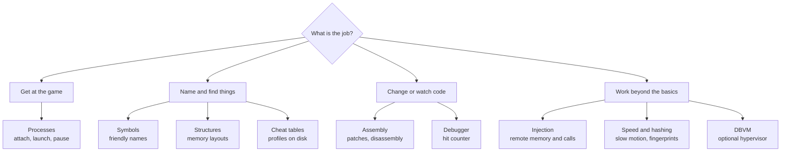

# Recipes

**One focused solution per Cheat Engine feature, with the smallest code that works.**

**Level** `Mixed` · **Time** `15 to 30 min each` · **Needs** `Guide 03`

[Examples index](../README.md) · [API guide](../api/README.md) · [Complete trainer](../12-trainer/README.md)

---

## What a recipe is

The numbered guides teach the SDK. The recipes use it. Each one takes a job you meet in real plugins, such as attaching
to a game, naming an address, toggling a patch or counting writes, and solves it end to end. Every recipe is its own
small project, so you can copy one without the others.

Each recipe has the same parts:

| Part              | What it gives you                                                                      |
|-------------------|----------------------------------------------------------------------------------------|
| **Glance table**  | What you build, what you learn, what you need, and the Cheat Engine functions it binds |
| **Bindings**      | The `[LuaGlobal]` declarations, ready to paste into your plugin                        |
| **A working use** | A `[LuaFunction]` or a helper that puts the bindings to work                           |
| **A Lua session** | What to type in the Lua Engine window and what to expect                               |
| **Good to know**  | The traps of that feature                                                              |
| **Promise**       | What the code guarantees                                                               |

## Pick a recipe

| Recipe                                           | Level        | Time   | You build                                                                            |
|--------------------------------------------------|--------------|--------|--------------------------------------------------------------------------------------|
| [Processes](processes/README.md)                 | Beginner     | 15 min | Attach to the game or launch it, and take a consistent snapshot while it is paused   |
| [Symbols](symbols/README.md)                     | Intermediate | 20 min | A symbol book that names addresses, and a watcher that waits for a module            |
| [Assembly](assembly/README.md)                   | Advanced     | 30 min | A patch you can switch on and off, a disassembly listing and a line assembler        |
| [Cheat tables](cheat-tables/README.md)           | Intermediate | 20 min | A profile keeper that saves and restores the open table                              |
| [Debugger](debugger/README.md)                   | Intermediate | 25 min | A write watcher that counts hits and remembers where they came from                  |
| [Injection](injection/README.md)                 | Advanced     | 30 min | A remote call helper, a checked DLL injector and a patcher                           |
| [Structures](structures/README.md)               | Advanced     | 30 min | A `Player` structure defined in code and a structure lister                          |
| [Speed and hashing](speed-and-hashing/README.md) | Beginner     | 15 min | A slow motion toggle and a binary verifier                                           |
| [DBVM](dbvm/README.md)                           | Advanced     | 30 min | A status probe, a physical memory reader and a write watcher that degrade gracefully |

## Cheat Engine functions by recipe

Find the recipe that already binds the function you need. Read the exact signature in `celua.txt` before you reuse one.

| Recipe                                           | Functions bound                                                                                                                                                                                                                |
|--------------------------------------------------|--------------------------------------------------------------------------------------------------------------------------------------------------------------------------------------------------------------------------------|
| [Processes](processes/README.md)                 | `openProcess`, `getOpenedProcessID`, `getProcessIDFromProcessName`, `createProcess`, `pause`, `unpause`, `isPaused`, `getForegroundProcess`, `targetIs64Bit`, `getThreadlist`, `enumModules`                                   |
| [Symbols](symbols/README.md)                     | `getAddress`, `getAddressSafe`, `getNameFromAddress`, `registerSymbol`, `unregisterSymbol`, `reinitializeSymbolhandler`, `getModuleSize`, `inModule`, `getRTTIClassName`                                                       |
| [Assembly](assembly/README.md)                   | `autoAssemble`, `assemble`, `disassemble`, `splitDisassembledString`, `getInstructionSize`, `getPreviousOpcode`, `getComment`, `setComment`                                                                                    |
| [Cheat tables](cheat-tables/README.md)           | `loadTable`, `saveTable`, `getAddressList`                                                                                                                                                                                     |
| [Debugger](debugger/README.md)                   | `debugProcess`, `debug_isDebugging`, `debug_isBroken`, `debug_setBreakpoint`, `debug_removeBreakpoint`, `debug_continueFromBreakpoint`, `debug_getBreakpointList`, `detachIfPossible`, and the `debugger_onBreakpoint` handler |
| [Injection](injection/README.md)                 | `allocateMemory`, `deAlloc`, `fullAccess`, `writeString`, `writeSmallInteger`, `executeCode`, `executeCodeEx`, `injectDLL`, `autoAssemble`                                                                                     |
| [Structures](structures/README.md)               | `createStructure`, `getStructureCount`, `getStructure`, and the structure members `addElement`, `addToGlobalStructureList`, `autoGuess`, `beginUpdate`, `endUpdate`                                                            |
| [Speed and hashing](speed-and-hashing/README.md) | `speedhack_setSpeed`, `speedhack_getSpeed`, `stringToMD5String`, `md5file`, `md5memory`, `ansiToUTF8`, `UTF8ToAnsi`                                                                                                            |
| [DBVM](dbvm/README.md)                           | `dbk_initialized`, `dbvm_initialized`, `dbvm_initialize`, `dbvm_getMemory`, `dbk_getPhysicalAddress`, `dbvm_readPhysicalMemory`, `dbvm_watch_writes`, `dbvm_watch_retrievelog`, `dbvm_watch_disable`                           |

Memory reads and writes, AOB scans, value scans and the address list have their own guides:
[04 · Memory](../04-memory/README.md), [05 · AOB scans](../05-aob-scans/README.md),
[06 · Value scans](../06-value-scans/README.md) and [07 · The address list](../07-address-list/README.md).

## Habits every recipe shares

- **Try forms for normal failures.** An unreadable address, a module that has not loaded and a missing file are ordinary
  events, so the bindings return `false` and the helpers answer with a value.
- **Throwing forms for bugs.** A Cheat Engine function that should always exist raises `LuaException` when it does not.
- **Objects follow the ownership rules.** A recipe disposes what it creates with `Owned<T>` and leaves Cheat Engine's
  own objects alone.
- **Every start has an undo.** A symbol, a breakpoint, a remote buffer or a patch comes with the code that removes it,
  called from `finally` or from `OnDisable`.
- **Distinct type names.** A recipe names its binding class after its job, such as `AsmCalls` or `TableCalls`, so two
  recipes can live in one plugin.

---

[Examples index](../README.md) · [API guide](../api/README.md)

