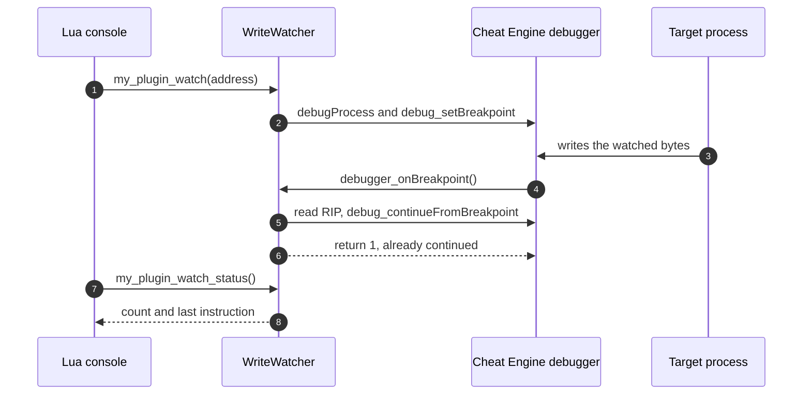

<div align="center">

# Recipe · Debugger hit counter

**Find out how often the game writes to an address, and from where, with one breakpoint and one handler.**

**Level** `Intermediate` · **Time** `25 min` · **Needs** `Guide 03`

[Examples index](../../README.md) · [Recipes](../README.md)

</div>

---

|                            |                                                                                                                                                                                                                |
|----------------------------|----------------------------------------------------------------------------------------------------------------------------------------------------------------------------------------------------------------|
| **You build**              | A write watcher: two Lua functions start and stop a breakpoint, a handler counts the hits                                                                                                                      |
| **You learn**              | Debugger bindings, enum arguments as numbers, the `debugger_onBreakpoint` global, reading register globals                                                                                                     |
| **You need**               | The bindings pattern from [03 · Calling Cheat Engine](../../03-calling-cheat-engine/README.md)                                                                                                                 |
| **Cheat Engine functions** | `debugProcess`, `debug_isDebugging`, `debug_isBroken`, `debug_setBreakpoint`, `debug_removeBreakpoint`, `debug_continueFromBreakpoint`, `debug_getBreakpointList`, `detachIfPossible`, `debugger_onBreakpoint` |

## Objective

Set a hardware write breakpoint on the bytes that hold the player's health, let the game keep running, and report how
many writes happened and which instruction did the last one.

## Why it matters

Cheat Engine calls one Lua global, `debugger_onBreakpoint`, every time a breaking breakpoint hits, and fills the
register globals before it does. That is the whole debugger contract for a plugin: export the global, read the
registers, decide whether to continue. The generator turns that into a typed C# method.

## How it works

### 1. Bind the debugger functions

```csharp
using CheatEngine.SDK.Annotations.Lua;
using CheatEngine.SDK.Engine.Enums;

namespace WriteWatch;

internal enum DebuggerKind
{
    Default = 0,
    Windows = 1,
    Vectored = 2,
    Kernel = 3
}

internal static partial class DebuggerCalls
{
    [LuaGlobal("debugProcess")]
    internal static partial void StartRaw(int debuggerInterface);

    [LuaGlobal("debug_isDebugging")]
    public static partial bool TryIsDebugging(out bool debugging);

    [LuaGlobal("debug_isBroken")]
    public static partial bool TryIsBroken(out bool broken);

    [LuaGlobal("debug_setBreakpoint")]
    internal static partial void SetBreakpointRaw(nuint address, int size, int trigger, int method);

    [LuaGlobal("debug_removeBreakpoint")]
    public static partial void RemoveBreakpoint(nuint address);

    [LuaGlobal("debug_continueFromBreakpoint")]
    internal static partial void ContinueRaw(int method);

    [LuaGlobal("detachIfPossible")]
    public static partial void DetachIfPossible();

    public static void Start(DebuggerKind kind) => StartRaw((int)kind);

    public static void SetBreakpoint(nuint address, int size, BreakpointTrigger trigger, BreakpointMethod method) =>
        SetBreakpointRaw(address, size, (int)trigger, (int)method);

    public static void Continue(ContinueMethod method) => ContinueRaw((int)method);
}
```

A binding cannot take an enum, so the raw methods take `int` and the public wrappers take the CheatEngine.SDK enums.
The values match Cheat Engine's own constants: `BreakpointTrigger.Write` is `bptWrite` (2),
`BreakpointMethod.DebugRegister` is `bpmDebugRegister` (1) and `ContinueMethod.Run` is `co_run` (0). The debugger
interface numbers are 0 for the default, 1 for the Windows debugger, 2 for the VEH debugger and 3 for the kernel
debugger.

### 2. Write the watcher

```csharp
using System.Text;
using CheatEngine.SDK.Annotations.Lua;
using CheatEngine.SDK.Annotations.Plugin;
using CheatEngine.SDK.Engine.Enums;
using CheatEngine.SDK.Engine.Values;
using CheatEngine.SDK.Hosting.Diagnostics;
using CheatEngine.SDK.Hosting.Plugin;
using CheatEngine.SDK.Lua.Calls;
using CheatEngine.SDK.Lua.Runtime;
using CheatEngine.SDK.Lua.State;

namespace WriteWatch;

[CheatEnginePlugin("Write Watch")]
public sealed class WriteWatchPlugin : CheatEnginePlugin
{
    protected override void OnEnable()
    {
        var status = WriteWatcher.RegisterLuaFunctions(LuaRuntime.AcquireState());
        if (!status.IsOk) throw new InvalidOperationException($"Lua registration failed: {status}.");
    }

    protected override void OnDisable()
    {
        WriteWatcher.Stop();
        WriteWatcher.UnregisterLuaFunctions(LuaRuntime.AcquireState());
    }
}

internal static partial class WriteWatcher
{
    private static nuint s_watched;
    private static bool s_startedDebugger;
    private static long s_hits;
    private static long s_lastInstruction;

    [LuaFunction("my_plugin_watch")]
    public static bool Watch(nuint address)
    {
        if (Volatile.Read(ref s_watched) != 0 || !DebuggerCalls.TryIsDebugging(out var debugging)) return false;
        if (!debugging)
        {
            DebuggerCalls.Start(DebuggerKind.Default);
            s_startedDebugger = true;
        }

        Interlocked.Exchange(ref s_hits, 0);
        Volatile.Write(ref s_watched, address);
        try
        {
            DebuggerCalls.SetBreakpoint(address, 4, BreakpointTrigger.Write, BreakpointMethod.DebugRegister);
        }
        catch (LuaException)
        {
            Volatile.Write(ref s_watched, 0);
            throw;
        }

        return true;
    }

    [LuaFunction("my_plugin_unwatch")]
    public static bool Stop()
    {
        var address = Volatile.Read(ref s_watched);
        if (address == 0) return false;

        Volatile.Write(ref s_watched, 0);
        try
        {
            DebuggerCalls.RemoveBreakpoint(address);
            if (s_startedDebugger) DebuggerCalls.DetachIfPossible();
            s_startedDebugger = false;
            return true;
        }
        catch (LuaException exception)
        {
            HostLog.Write(HostLogLevel.Warning, "Removing the write breakpoint failed.", exception);
            return false;
        }
    }

    [LuaFunction("debugger_onBreakpoint")]
    public static long OnBreakpoint(LuaState state)
    {
        if (Volatile.Read(ref s_watched) == 0) return 0;

        Interlocked.Increment(ref s_hits);
        if (TryReadRegister(state, "RIP"u8, out var instruction) || TryReadRegister(state, "EIP"u8, out instruction))
            Interlocked.Exchange(ref s_lastInstruction, instruction);

        DebuggerCalls.Continue(ContinueMethod.Run);
        return 1;
    }

    [LuaFunction("my_plugin_watch_status")]
    public static string Status()
    {
        var address = Volatile.Read(ref s_watched);
        if (address == 0) return "not watching";

        var last = Interlocked.Read(ref s_lastInstruction);
        return $"watching 0x{address:X}: {Interlocked.Read(ref s_hits)} write(s), last instruction 0x{last:X}";
    }

    [LuaFunction("my_plugin_breakpoints")]
    public static string Breakpoints(LuaState state)
    {
        using LuaFrame frame = new(state);
        if (!state.TryGetGlobal("debug_getBreakpointList"u8).IsOk || !state.TryCall(0, 1).IsOk || !state.IsTable(-1))
            return "unavailable";

        var count = state.RawSequenceCount(-1);
        if (count == 0) return "none";

        StringBuilder list = new();
        for (var i = 0; i < count; i++)
        {
            state.RawGetSequenceItem(-1, i);
            if (state.TryReadInteger(-1, out var address)) list.Append(i == 0 ? "0x" : ", 0x").Append(address.ToString("X"));
            state.Pop(1);
        }

        return list.ToString();
    }

    private static bool TryReadRegister(LuaState state, ReadOnlySpan<byte> name, out long value)
    {
        using LuaFrame frame = new(state);
        value = 0;
        return state.TryGetGlobal(name).IsOk && state.TryReadInteger(-1, out value);
    }
}
```

`debugger_onBreakpoint` takes a leading `LuaState`, which the generator fills with the state Cheat Engine called you
with, and it is not a Lua argument. The register globals are plain Lua integers. A 64 bit target fills `RIP` and a
32 bit target fills `EIP`, so the handler tries both.

### 3. Drive it from Lua

```lua
local health = getAddress("game.exe+1A2B3C")
print(my_plugin_watch(health))          -- true
-- play the game, take some damage
print(my_plugin_watch_status())         -- watching 0x7FF612341A2B: 3 write(s), last instruction 0x7FF6123489C4
print(my_plugin_breakpoints())          -- 0x7FF612341A2B
print(my_plugin_unwatch())              -- true
```



## Good to know

| Topic        | Detail                                                                                                                                                                                                                      |
|--------------|-----------------------------------------------------------------------------------------------------------------------------------------------------------------------------------------------------------------------------|
| Return value | `debugger_onBreakpoint` returns 0 to let Cheat Engine update its interface, and anything else when your handler already continued. The watcher returns 0 while it is idle, so a breakpoint you set by hand behaves as usual |
| One handler  | Cheat Engine has a single `debugger_onBreakpoint` global, so a table script that defines its own and this plugin overwrite each other. `UnregisterLuaFunctions` sets it back to `nil`                                       |
| Cleanup      | `OnDisable` calls `Stop`, so no breakpoint outlives the plugin. `detachIfPossible` detaches the debugger only when the watcher started it                                                                                   |
| Threads      | The counters use `Interlocked` and `Volatile`, so the handler stays correct whichever thread Cheat Engine calls it from                                                                                                     |
| Stepping     | `debug_continueFromBreakpoint` also accepts `ContinueMethod.StepInto` (1) and `StepOver` (2)                                                                                                                                |

The rest of the debugger surface follows the same pattern: bind the function you need.

| Feature               | Cheat Engine function                                                                                      |
|-----------------------|------------------------------------------------------------------------------------------------------------|
| Interfaces            | `debugProcess`, `debug_getCurrentDebuggerInterface`                                                        |
| Breakpoints           | `debug_setBreakpoint`, `debug_setBreakpointForThread`, `debug_removeBreakpoint`, `debug_getBreakpointList` |
| Context and registers | `debugger_onBreakpoint` and the register globals, `debug_getContext`, `debug_setContext`                   |
| Stepping              | `debug_continueFromBreakpoint`, `debug_isStepping`                                                         |
| Threads               | `debug_breakThread`, `debug_addThreadToNoBreakList`                                                        |
| XMM and LBR           | `debug_getXMMPointer`, `debug_setLastBranchRecording`, `debug_getLastBranchRecord`                         |
| Detach                | `detachIfPossible`                                                                                         |

## Promise

- A Try form such as `TryIsDebugging` returns `false` instead of throwing when the function is missing or raises.
- The generated thunk catches every exception. A failure inside the handler reaches Lua as an error, never Cheat Engine.
- The Lua stack returns to its previous height after every call, and `LuaFrame` restores it after each register read.
- `UnregisterLuaFunctions` removes every exported global, including `debugger_onBreakpoint`.

## Before you move on

- [ ] `my_plugin_watch(address)` returns `true`, and `my_plugin_breakpoints()` lists the address.
- [ ] `my_plugin_watch_status()` reports the hits and the last instruction.
- [ ] Unticking the plugin removes the breakpoint.

---

<div align="center">

[Examples index](../../README.md) · [Recipes](../README.md)

</div>
